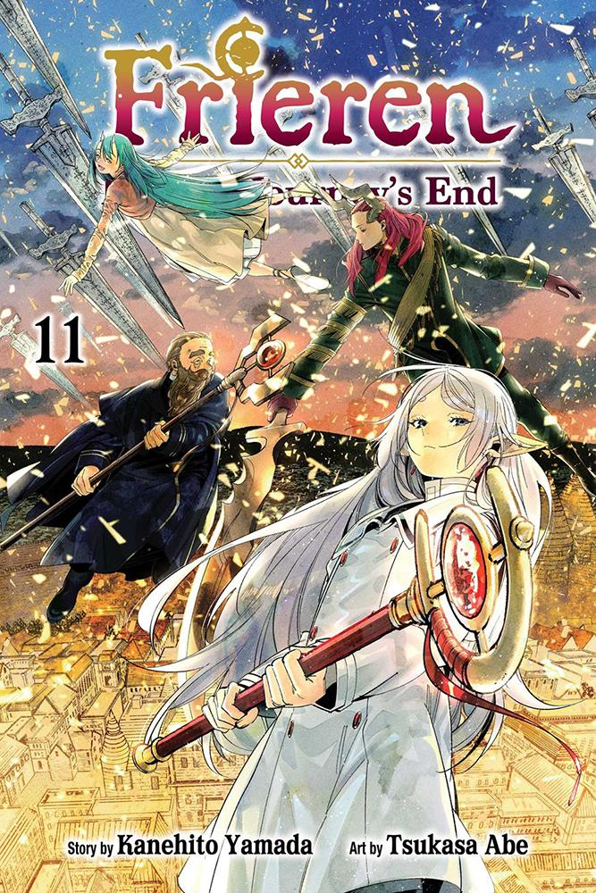
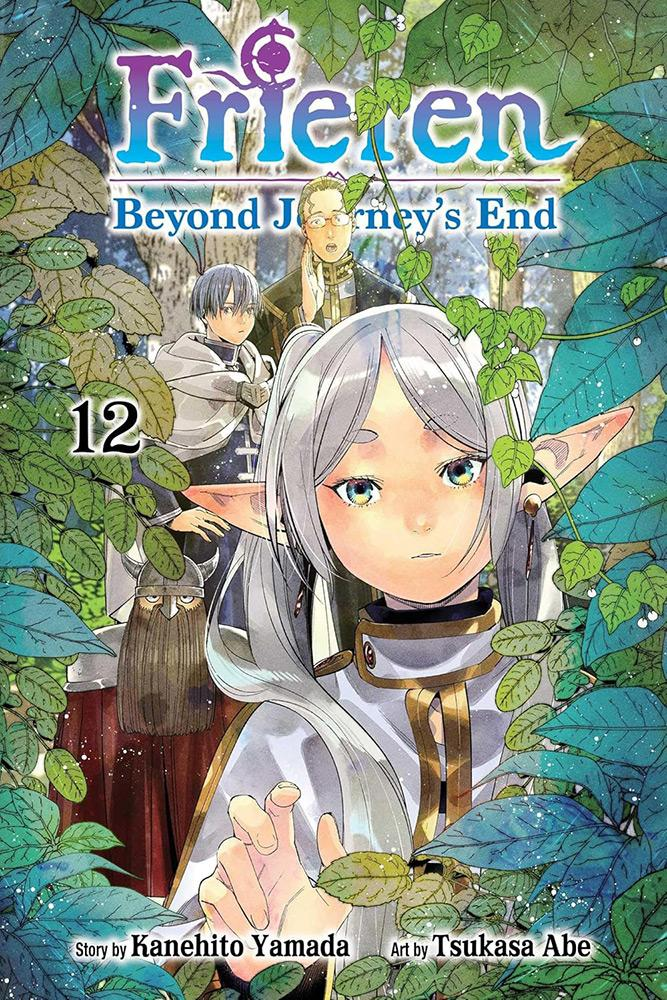

# Frieren beyond journey's end fern

## Sammanfatning

Frieren är en veldigt intresant serie som förjer Frieren en elf när hon utforskar värden efter att henes föra grup slutförde sit updrag att besegra "**The demon King**"

## Böker

Rosention skaknas för visa eftresom att jag inte har orkat att gå tillbara och endart dem

* [Bock 11](https://)
* [Bock 12](https://)

---

### 11

I den här boken fortsätter striden mellan Frieren och Solitär, samt "Den där demonen som kan göra saker till guld" mot "Den där gamla gubben".

Båda striderna var intressanta och spännande.

När de besegrade demonerna så fortsätter Frierens gäng mer norrut där de hjälper några byar. I slutet av boken ville Frieren ta en avstickare och titta på en staty till minne av "gudinnorna" (gudarna som prästerna ber till för sin magi) som hon hade varit vid för många år sedan, men hennes tidigare grupp villen inte spenderas så mycket tid och undersöka den så pass noggrant. Nu visar det sig att hon blev teleporterad tillbaka i tiden och hon måste nu hitta ett sätt att ta sig tillbaka, och det är där boken slutar.

Jag tycker att den här boken var väldigt intressant och hade väldigt bra fightscener.

### 12

I den här boken har Frieren blivit teleporterad tillbaka i tiden och hon vill hitta en väg tillbaka.

I början ville hon inte visa sin magi, men när en ganska kraftfull demon med teleporteringsmagi dyker upp så är hon tvungen att använda lite kraftfull magi.

När den är hanterad så går de på en jakt och försöker hitta information om vilken trollformel de behöver använda för att ta sig tillbaka. Under tiden försöker Frieren inte berätta alldeles för mycket om vad som har förändrats i framtiden.

Vi får veta lite om hur "holy magic" fungerar. Det visar sig att någon hade ristat in formeln som krävs i stenen, men när de kommer tillbaka så visar det sig att 4 andar av demoner hade detekterat att den första hade dött, så de kom för att undersöka.

Solitär inser att det är Frieren och därmed håller ett säkert avstånd eftersom hon inte vill dö, medan de andra går till attack.

I slutändan använder Grausam sin hypnosmagi och paralyserar alla.
I slutet av boken ser vi hur Himler inbillar sig att han gifter sig med Frieren.

Väldigt intressant bok eftersom vi får veta mer om hur Frierens förra grupp betedde sig, men jag hoppas att vi kommer tillbaka till den normala tidslinjen eftersom jag är mer intresserad av hur den utvecklas.

Observation: I en av de tidigare böckerna kommenterade en annan person som kan använda hypnos att Frieren för svär är väldigt kraftfull, och i striden efteråt där Frieren strider mot sig själv så använder hon teleporteringsmagi. Betyder detta att Frieren lärde sig av den här striden den första gången hon gjorde den och därefter utvecklade ett försvar mot hypnos och ett sätt att använda teleporteringsmagi?
