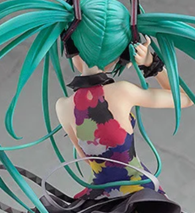

# Kläder

# Saker jag har syt

|                                 Designs                                 |
| :------------------------------------------------------------------------: |
| [Armless Dress](https://caspian.rosengren.nu/Kläder/Armless_Dress.html) |
|  [CoolKläning](https://caspian.rosengren.nu/Kläder/CoolKläning.html)  |

# Coola saker jag inte har sytcol

## Hatsune Miku från Tell Your World Ver

[bild](https://www.cosrea.com/products/vocaloid-hatsune-miku-tell-your-world-cosplay-costume)

Beroende på modelen så we baksidan antingen öpen eller så är der bara en tröja utan armar,hur i hella skiten man tar på ig den är en hellt annan fråga

Kjolen er förmodligen en vanlig kjol

## Andra kola designds

[KoolKläning](https://www.goodsmile.com/en/product/12825/TENITOL+NEO+TOKYO+Series+IDOL)

### [Svart Kläning](https://caspian.rosengren.nu/Kläder/SvartKlaning.html)

## Någoting annat

Kjolen är enkell, standard "Pleat". Integrera några ficker så att den går att använda, blixtlås på sidan. Måste hitta ett tyg som har stuktur nog att hålla väken.
Tröjan blir lite intresant. Armarna är enkla, gör dem lite puffiga.

Frågan är om den markerade dellen är en separat tyg bit eller om krage monteras ovan på en tröja,
måste även hitta ett set att få igenom mit huvod.
Tyget får vara någont lite med mer flytande, kanske använder ett tyg under för lite mer stuktur 

## Cosplay

| Designs                                                               |
| ----------------------------------------------------------------------- |
| [Firn](https://caspian.rosengren.nu/Kläder/cosplay/firnCosplay.html) |
| [2B](https://caspian.rosengren.nu/Kläder/cosplay/2B-Cosplay.html)    |
