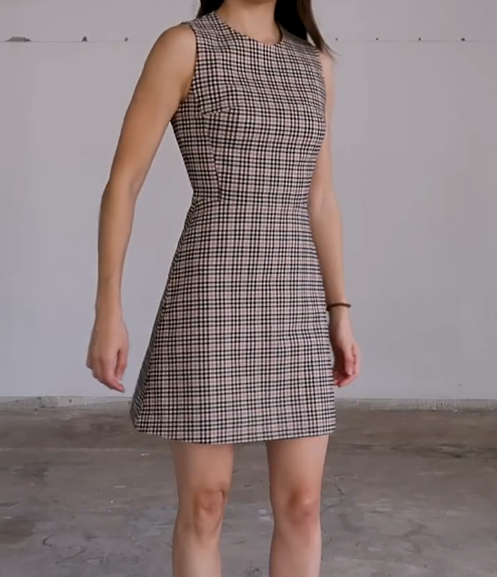
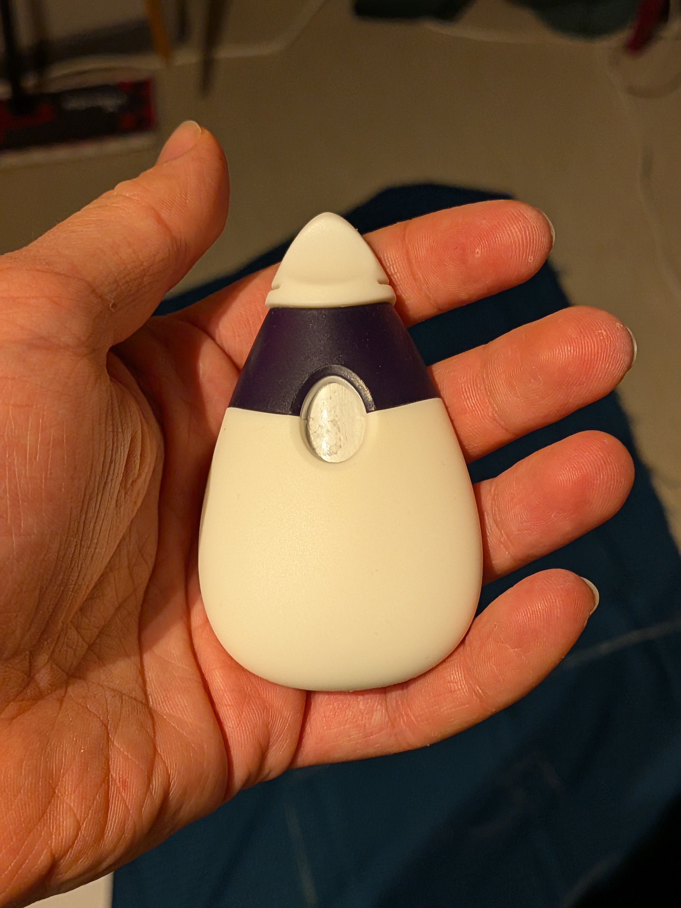
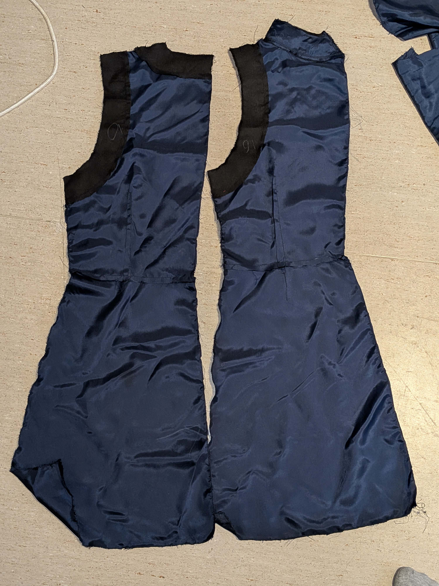
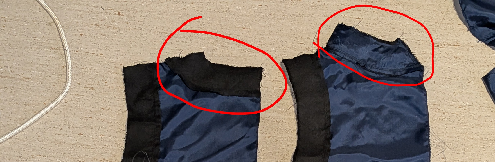
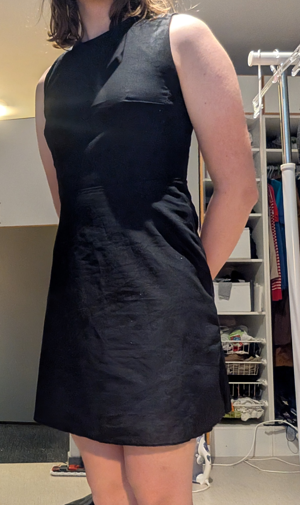
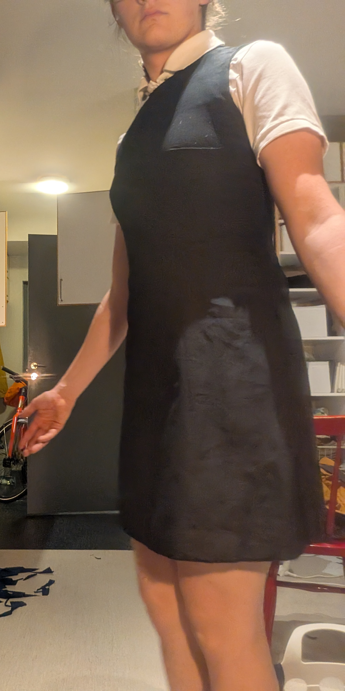

# Kläning

| Inehåll     |
| -------------- |
| Design       |
| Tygg         |
| Konstruction |
| Resultat     |

## Design

Designen var köt från den har [videon](https://www.youtube.com/watch?v=GD1ltfBQl4o). Den kostade mig 70kr och för de priset var den värt de. Instruktionerna är fantastiska och den passar fantastiskt.

Jag modefierade kjolen så att den blev längre och jag la till två sido ficker men annar använde jag orginal designen

## Tygg

Både prototypen och den färdiga kläningen avnänder intärnt systetiskst foder, de är bekvämt mot huten och gör det enkelt att ta på sig den. Prototypen använde ett billigt pototyp tyg medans den fördiga designen anänder ett ganska kjokt tyg

^Från höger till vänser.

Förstäknings tyg du stryker fast för att förstärka visa dellar av tyget

Primära tyget, lite strech och ganska tjockt

Foder

^Prototyp tyg, väldigt enkelt att klippa och arbeta med

## Konstruction

Alla pappar klipten ut och klistrades saman, lyckades övertyga en kommpis at hjälpa till. En sådan här markerings pena är fantastisk för att markera mer flexibelt tyg

Allt blev upmärkt och sedan klipt ut

På prototypen så syde jag lite fell men ingen kommer se de

Den passar

# Resultat

Prototypen blev litte tight men den ändå lyckad
den färdiga designer blev lyckad

