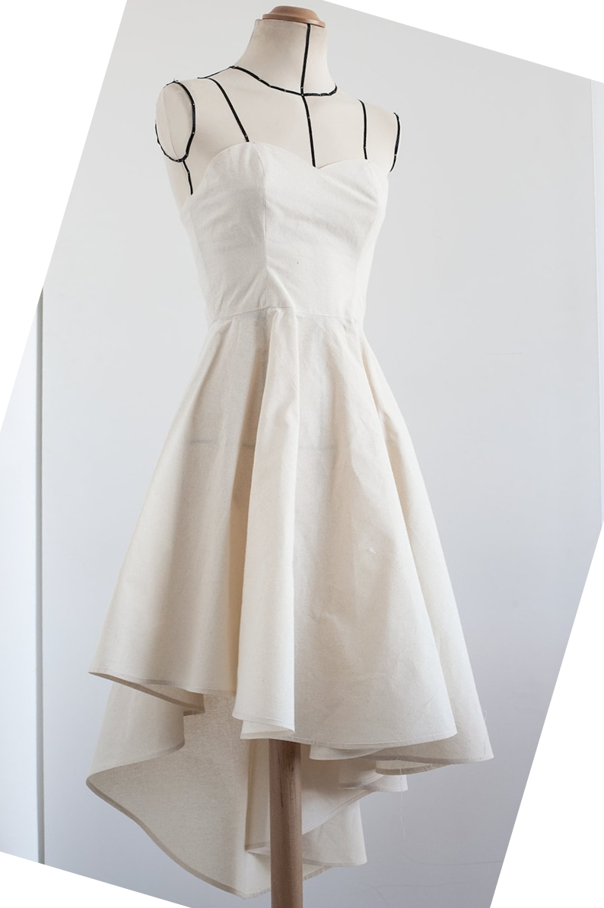
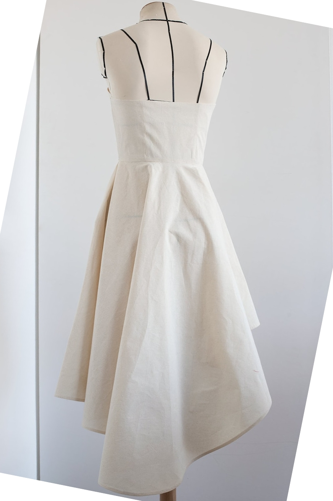
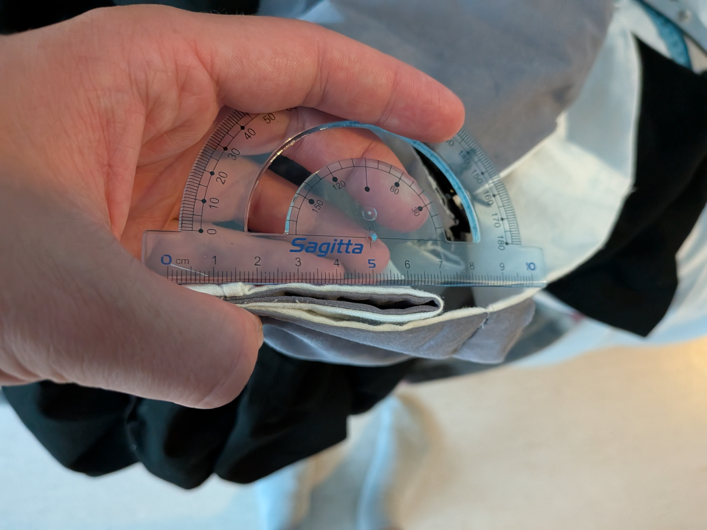
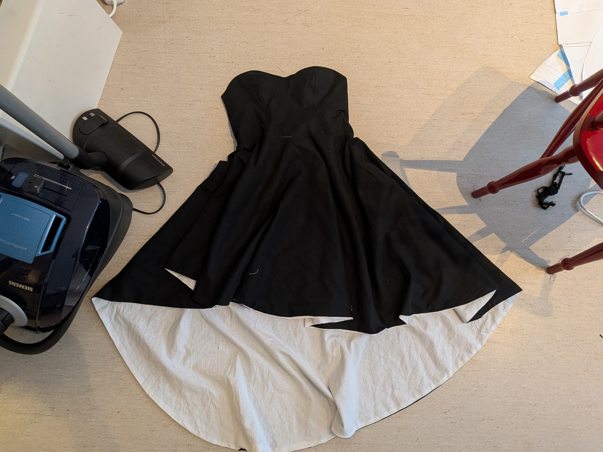
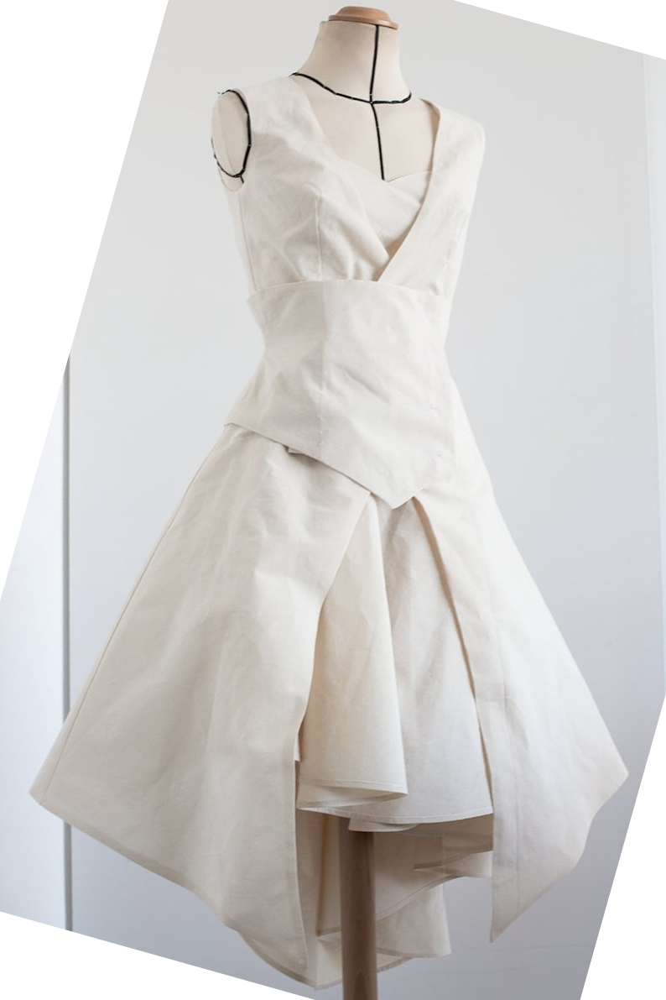
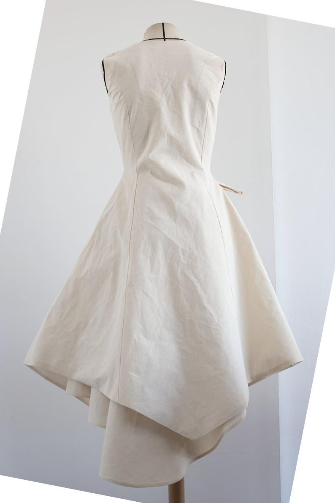
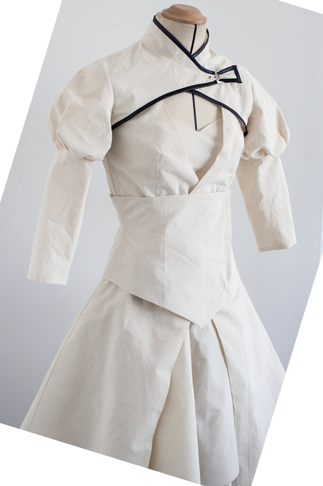
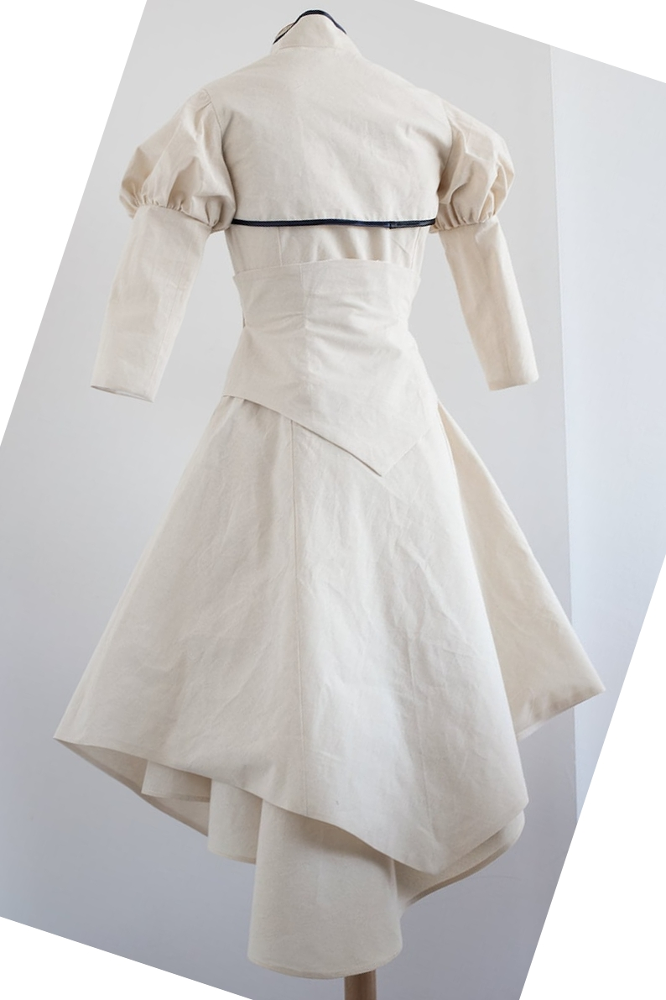

[Lenk till produkten](https://www.etsy.com/se-en/listing/788475867/weiss-inspired-outfit-pdf-cosplay-sewing?ls=s&ga_order=most_relevant&ga_search_type=all&ga_view_type=gallery&ga_search_query=2b+cosplay+pattern&ref=sr_gallery-1-37&pro=1&sts=1&dd=1&content_source=fe7bece6b24a445534d5e88632e2b6465e5c6613%253A788475867&organic_search_click=1&logging_key=fe7bece6b24a445534d5e88632e2b6465e5c6613%3A788475867)

# Straples kläning

Hur bilderna ser ut

### Hur men ser ur

^ Pasformen är inte den enklaste att få korekt 

^ Färdig, passar axeptabelt 

