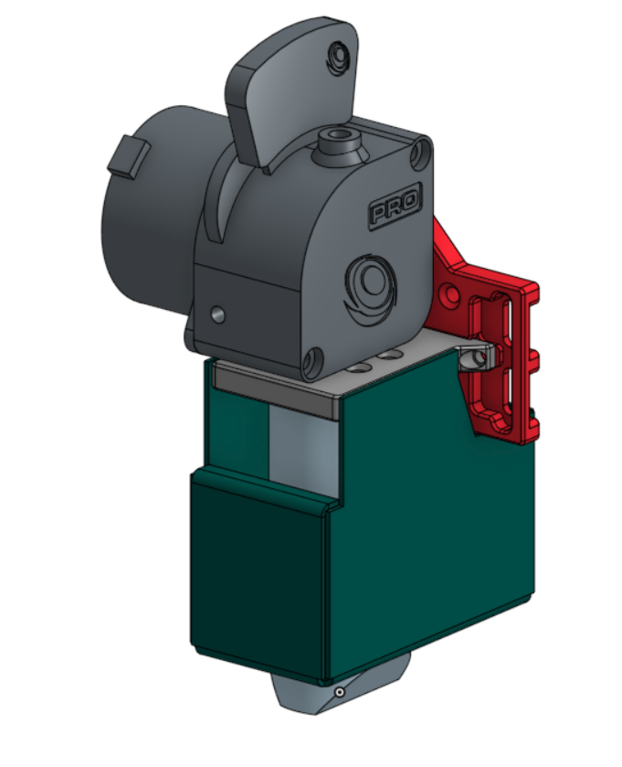
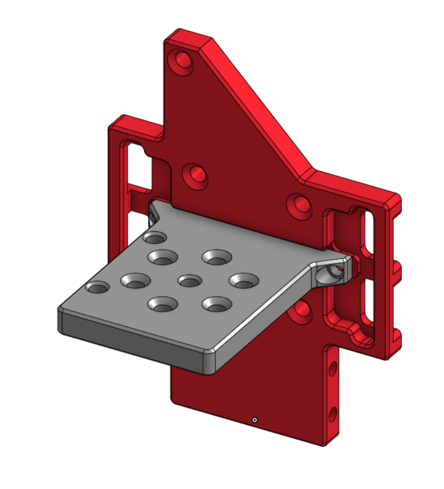

## 3d skrivare

## Mål

Mållet med den här skrivaren är att bygga en relativt snabb 3D-skrivare som uppfyller följande mål:

- 450 °C pipa
- 100 °C kammare
- 250 °C KylarFläkt
- print yta x:100, y:200, z:100
- RepRap
- Vattenkyld
- Hela ramen ut av 8mm aluminiom plater
- \>= 9mm belts

## Botiker

- [Motedis](https://www.motedis.se/se)
- [3dkatten](https://www.3dkatten.se/ "https://www.3dkatten.se")
- [BondTech](https://www.bondtech.se/)
- [Lukes Lab](https://www.lukeslabonline.com/)
- [Polsk sida en person rekomenderade för att köpa skruvar](https://www.ebmia.pl)
- [Skener](bstautomation.com)

## Komponenter

Kartision som en Endre 5 men med en mycket störe motor

styv och fin

---

### Z axel

Tills vidare kommer jag behålla den ursprungliga Z-axeln, men jag kommer nog uppgradera till en trepunkts dynamisk platta i framtiden.

## Design

Har nu gjord en första design runda med bellows

Detta systemet använder bellows för att skyda electroniken från den varma kammaren. den har 4 bellows, två för y(blå) och x(grön)

---

Updatterad modellen av hållarna till bellowsen så att dem faktiskt kan poduseras

### Extruder 

[LGX Lite PRO eXtruderBondte](https://www.bondtech.se/product/lgx-lite-pro-extruder/) + [Chube Air](https://3do.dk/en/complete-hotend/2521-chube-air.html) och [Chube Air Water Block](https://3do.dk/en/spare-parts/2519-chube-air-water-block.html)

### Vald extruder(gammal design)

LGX Light eller LGX Light Pro, Chube air med vatenkylnign, och en egen designad fäste

Fäste

gjord av aluminion i två dellar

### Electronik

- xy axlen kommer använda [LDO-42STH48-2504AHS8 S55](https://3dkatten.se/products/ldo-42sth48-2504ahs8-s55-1) stegmotorer tills vidar
- [Duet 3d](https://www.duet3d.com/) kommer användas för all kontrol electronik
  - [Duet 3 Mini 5+](https://www.duet3d.com/duet3mini5plus) för kontroll av skrivaren
  - [Duet 3 Tool Board 1LC](https://www.duet3d.com/duet3toolboard1lc) eller [Duet 3 Roto Toolboard](https://www.duet3d.com/Duet3RotoToolboard) för att göra kabeldragningen till huvodet enklare
  - [Duet 3 Scanning Z Probe](https://www.duet3d.com/Duet3ScanningZProbe) för att skanna platan
  - [Duet 3 Mini 2+](https://www.duet3d.com/duet3expansionmini2plus) om jag behöver 2 extra motorer om jag använder 3(z) och 4(x och y) stegmotore
  - [Duet3D Roto Filament Monitor](https://www.duet3d.com/rotofilamentmonitor) eller [Duet3D Filament Monitor](https://www.duet3d.com/filamentmonitor) för att dettektera och varna mig när någonting är fell med matningen av plasten
- 24v ac och 230v dc systemet har inte mestämtes en
