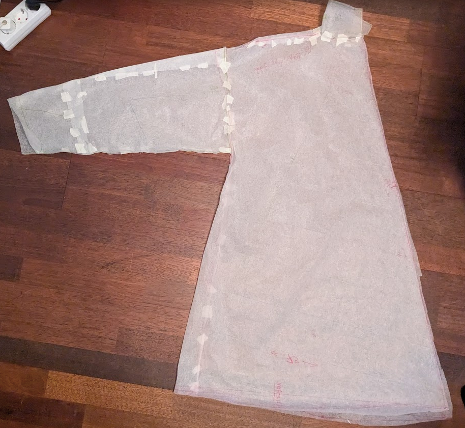
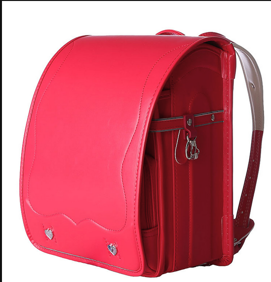
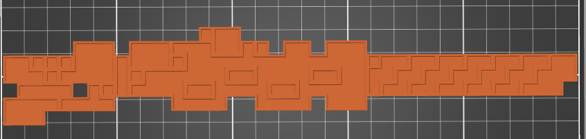

# Firn

## Design

1. [Gul jaka](https://)
2. [Blå hoddy](https://)
3. [Tights](https://)
4. [Gulla stikade stomper](https://)
5. [Vandrings känger](https://)
6. [Veska](https://)
7. [Gevär](https://)

## Gul jagka

### Mönster

### Material

Utsidan skall vara Gul eller unange och Skall vara ett tjokt bomull eller ull tyg

Insidan skall var ett foder som skall gör minemera friktionen

### Konstroktion

Bygs på något viss.

Fikerna skall ha en knapp för att stänga och jag skall kuna få plats med en telefon i dem

Det skall finas knappar för att kuna stänga jagkan och en back flärp för luft flöde

## Blå hoddyHod

### Mönster

Något enkelt mönster jag hittar

### Matriall

Förmodligen någonting tunt så att jag inte överhettar

### Konstroktion

Skall ha en luva och drag strengar

Nedre streket kommer jag sy på

## Tights

Köpta

## Gulla stikade stomper

Kommer vara stikade i samarbette med formor

Antingen faktioska stumper eller bara den dellen man kan se berroende på hur varm jag vill vara

## Vandrings känger

Köpta, kommer förmodligen vara ett helveta att gå runt i eftresom att dem är designade att man går på mjuk mark

## Veska

Inte säker om jag kommer göra den

### Design

Någonting is sitll med den här fast platare,

Desutom menterings remar för ett situnderläg och annan julgrans pakning

### Material

Läder?

## Gevär

Skall vara 2d med leds integrat för att simulera animationen

Kommer kräva drivellectronik för neopixlarna
