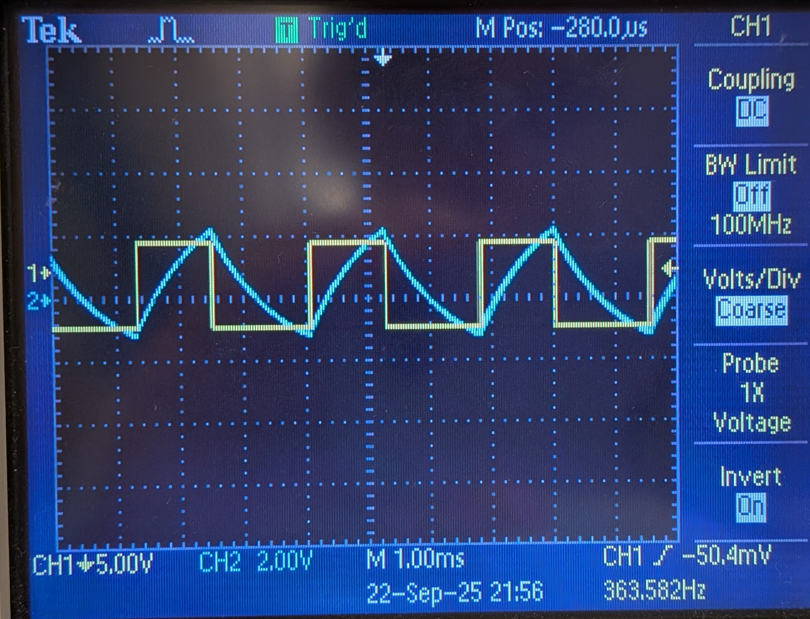
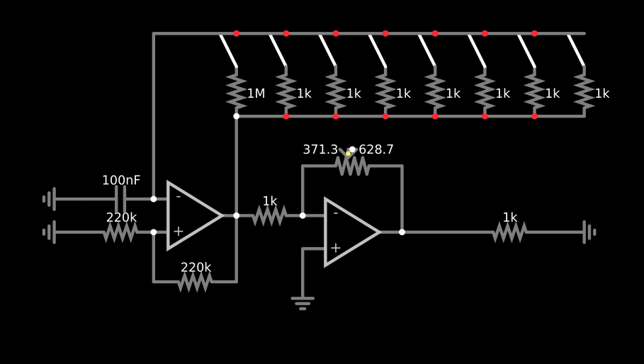
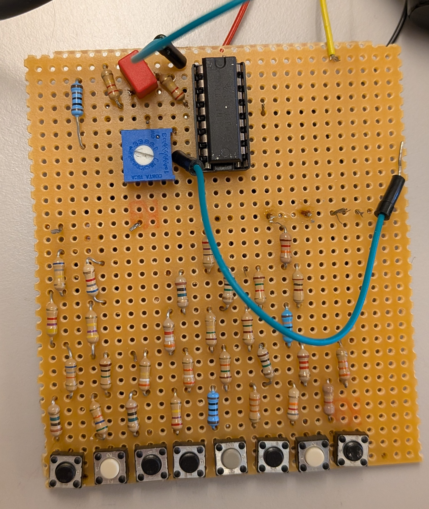
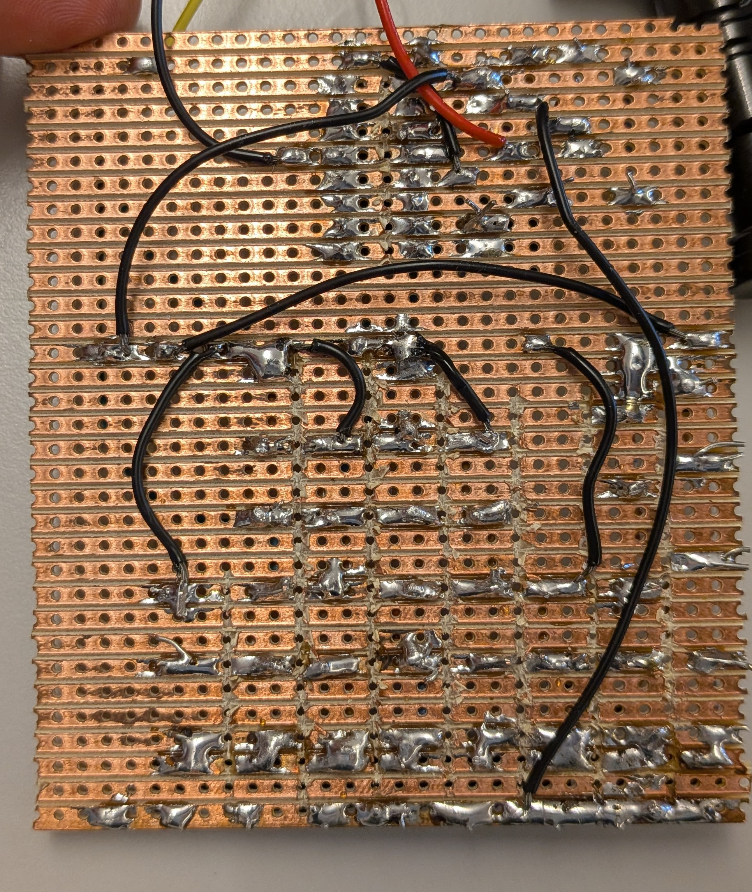

# Skol cynt

## Teori

Snude designen [Här ifrån](https://www.instructables.com/Make-an-Awesome-Analog-Synthesizer/)

Det är en smit triger som är aktiverad av en kondensater som ladas och urladas av trigern

Gull är ut och blå är ladningen över kondensatorn

## Design

Design fillen är [här](https://www.falstad.com/circuit/circuitjs.html?ctz=CQAgjCAMB0l3AWAnC1b0DZwwExxwOwEDMkAHDhigSAKxl12R0CmAtGGAFACGIZxHCBxkGSMEJEMGtEG1lh48KCsVLeIJASykE2AkN39G87EuYWz8LgCdNE4aM3bHDZmshcA7s6xTfwggW3vqGkHqKBoHBYAR6Wn5BodHgVlDQxARgxCAASiwAzgCWBQAuPAB2AMYsXADmAYLMCSDEGG5QtvyCrbRC4oZ9Kjh41j4Cg0ITreGdPgO9-Q7+nnbTRtoMRswj6lXdklGbwlERsOYX8GDsNBbnEJ4Nx4RCJH5RwfMOYEhLkk6ecY9ThTHovObJIycIbbLrQsIRUYzPTuawNCRwZHgHAILazT72IQ-Ik4hjEzp2BbkqkIFFWawFQngWlMkGqEClGwAV1qjKQGHcLP57gc7g53NqlIF4F+mmlYBZqLgcMgtCw5MUauZdI8XEZmvVLIN4FFqU5PL1ZjJRrgZNNEHNkqtMqJtu1qmsdgx7ll3vdSs8+qRCsRmLZYsdlokuPd0btQgjErhpJd2JjIY9yq9YCGGpzRMVVij+djJfDZqT+sUESN1ZNCYrFuzszzLcLup8cfrB27jxAxw2bSxwSAA)(motstonden är fell för knaparna) och här är en [text fill](https://caspian.rosengren.nu/SkolSynt/Design.txt)

## Konstruktion

Första designen var en gjord på koplingskort, Här är en [film](https://caspian.rosengren.nu/Projekt/SkolSynt/FörstaFunkionelaDesignen.mp4) när jag fick den att generera en signal, här är [film](https://caspian.rosengren.nu/Projekt/SkolSynt/FungerandeHögtalare.mp4) när ja la till en spenings följare så att den kan driva en högtallare, och sedan så är här en [film](https://caspian.rosengren.nu/Projekt/SkolSynt/FuntionelKeybord.mp4) när tagenterna fungerar, allt deta var gjort på en fredag då jag inte hade någonting bätre att göra.

Här är den slutgiltiga designen fast ihoplädad, obsarvera att jag använder en tl074 istälet fär två tl071 eftresom att jag trode jag behövde mer en två

Tog ett tag att få alla signaller att komma fram och ted tog en evighet att hitta och löda fast de koreta motstånden

## Lite mätdatta

(den gula signalen är inverterad på den rena sida )

Den här grafen vissar all datta, och du kan se att signallen blir byket sämre när högtalaren är inkoplad, desutom så endras tonen beroend på frekvänsen
