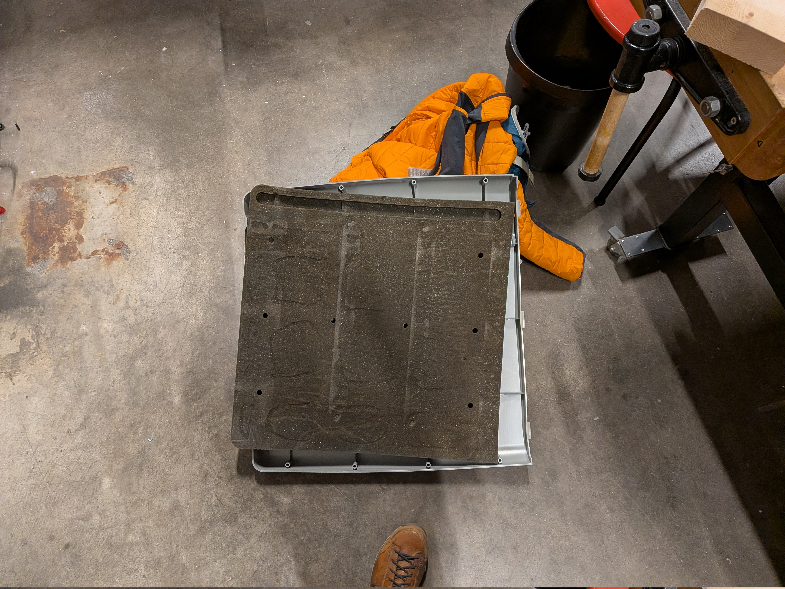
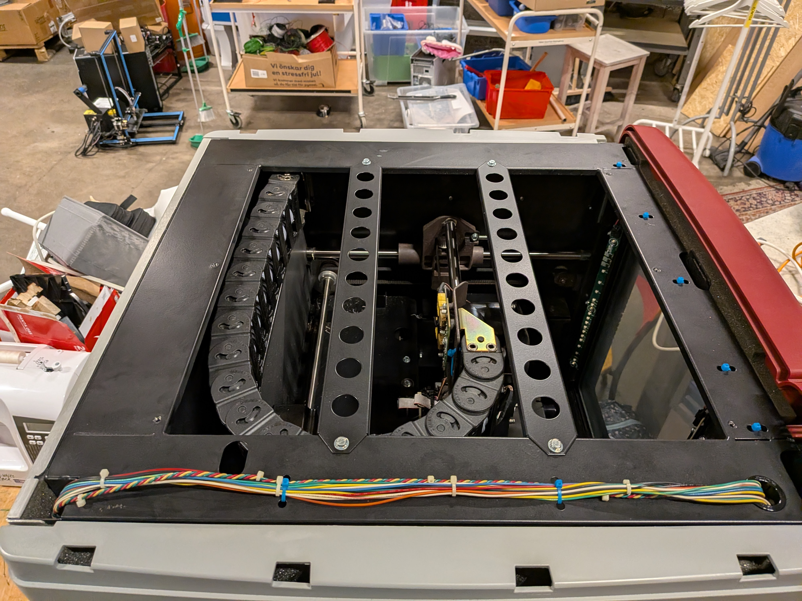
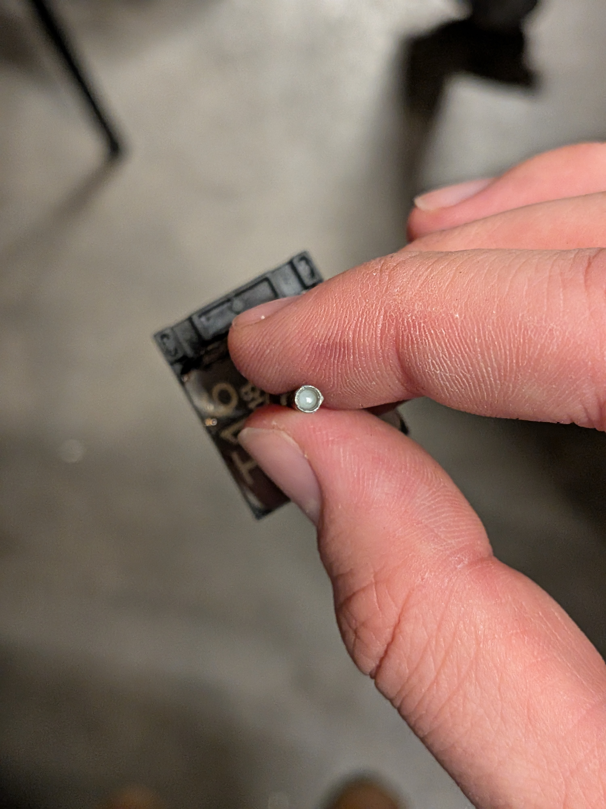
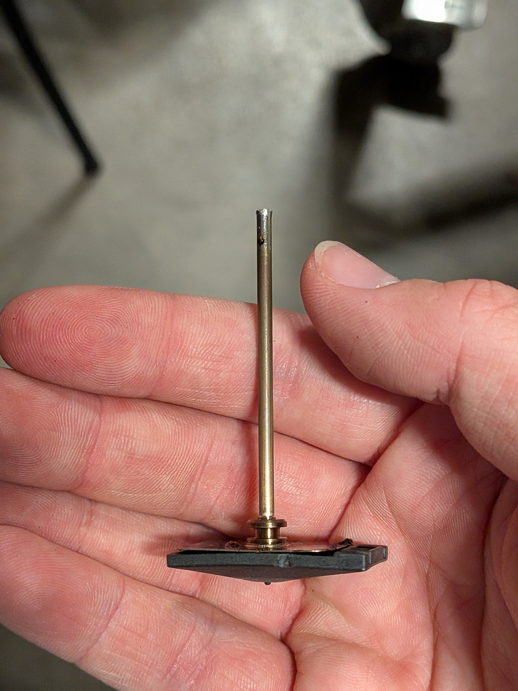
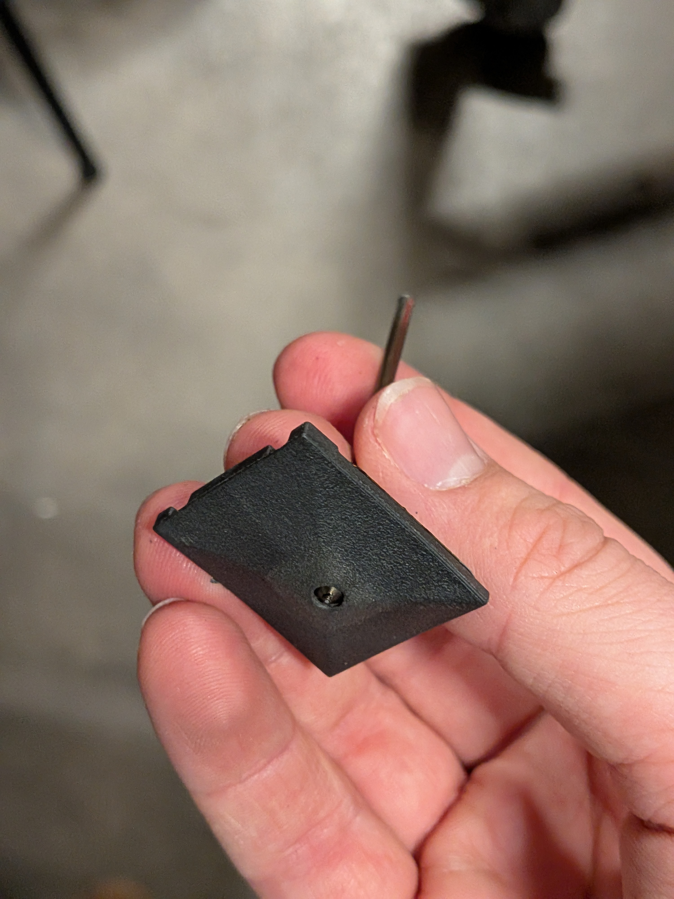
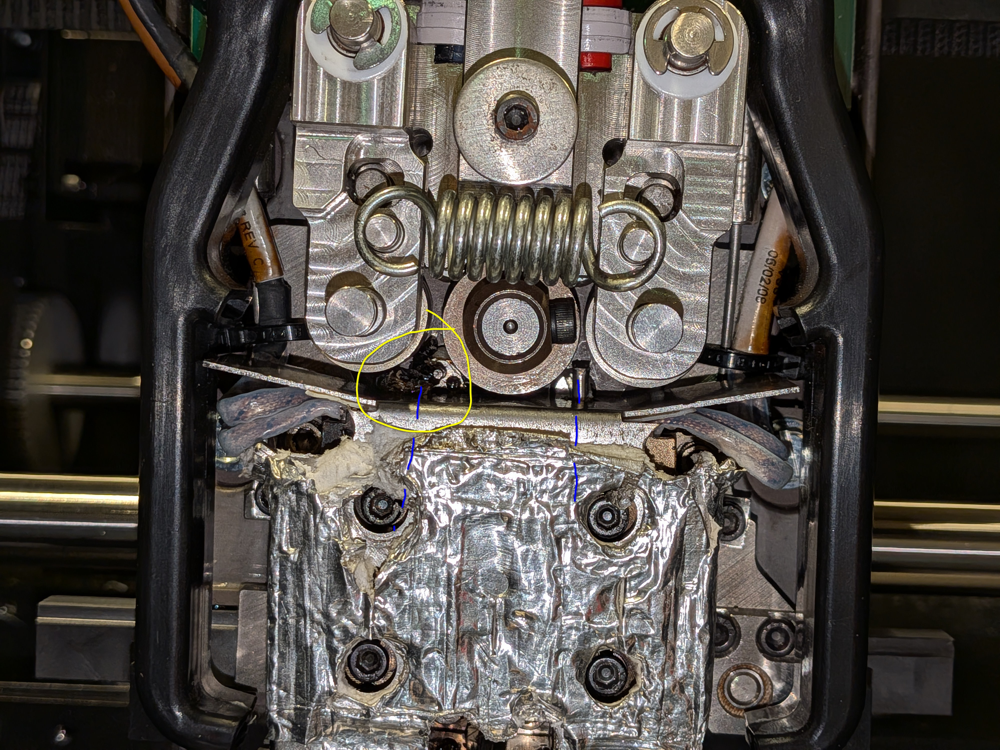
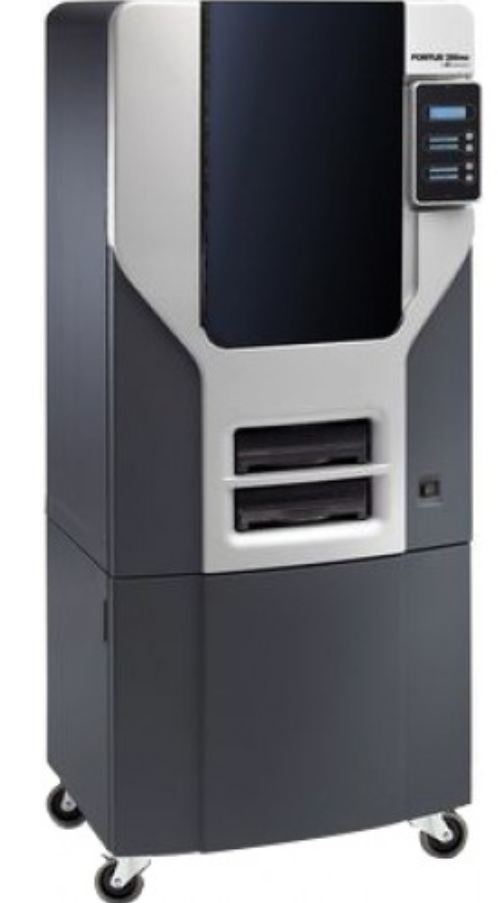
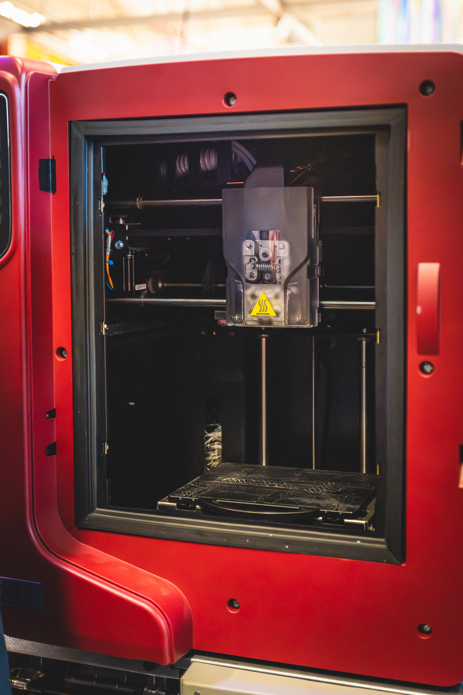
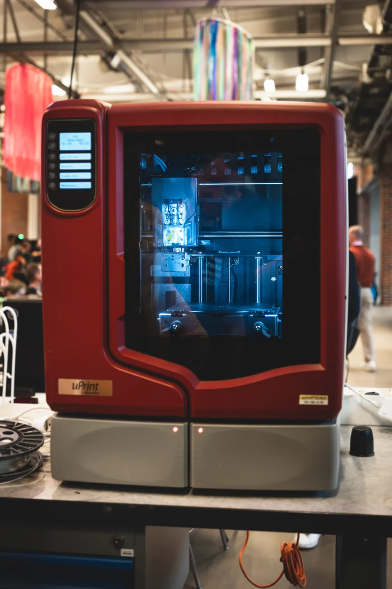
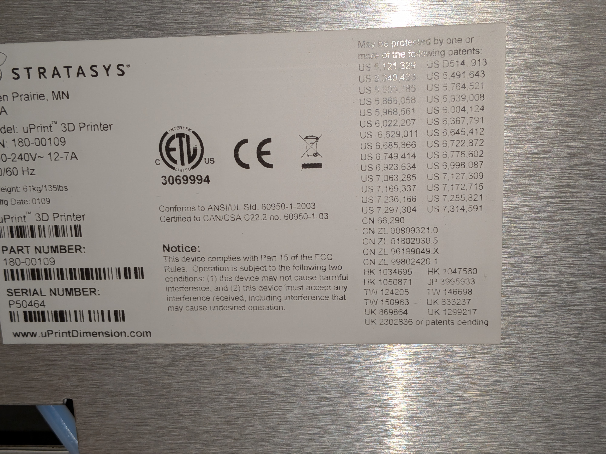

# [Stratasys uPrint](https://caspian.rosengren.nu/Projekt/Stratasys_uPrint.html#bilder)

## Bakgrund

Har velat jobba på en ht Skrivare ganska länge så när de visade sig att [Helsingborg Makerspace](https://helsingborgmakerspace.se/)

fick in a Stratasys uPrint så blev jag väldigt intreserad att fixa den.

## Komponeter

### Surivar yta

203 x 152 x 152 mm
Den är pyteliten och skiver på engångs ABS platter. Detta kan läsas genom att lima fast an g10 plata ovan på ABS plattan

### Kammare

Skrivarens kommare är rubost och väll isulerad.

Enligt folk på nätet sa ska man inte gå över 90c kammare på Stratasys uPrint.

Detta gör att vi kan printa ABS, PET, visa PA, och kanske PC.

Det visade sig att de fins minimal seperating mellan utsidan och kammare i taket, detta uptektes efter att jag tog bort de för att få mer ljus

### Huvod

uPrint använder ett intresant skrivar huvod viken vippar mellan två positioner. Den avänder även ståltuber med en lite pipa som nozzle

Detta gör att de är enkelt att bigga din egen pipa genom att skära ner en gammal v6 pipa. Du behöver bara ta hänsyn till ett par dimentioner so att den passar

Extrudern är lite intesat eftersom att den använder luft som en heatbrake 

Getta gör att man kan få clogs som ni kan se på den vänstra markerat med gul.

### Electronik

Detta kommer behöva ärsetas hellt eftersom att jag vill köra mjukvara som inte är äldre en mig på skrivaren.
Vi kommer ärseta den med en Duet3 och använda [de här adapter kortet]([https://github.com/jcwebber93/DuePrint3/]) designat av [sebkritikel](https://discord.com/channels/840596987522056232/840883984715218965/1480506571359387790). Vilket gör att vi kan använda RRF

### Bord

Skrivaren behöver ett nyt bord eftersom att skrivaren är >40kg och två av hjulen har rendan böjt. Skrivaren har monterings håll på undersidan där du kan läga till en till material hållare vilka vi kan avända för att montera den på ett bättre bord.

En ide att bygga någonting i still med en Fortus 250mc

då kan vi förvar Plast, platter, redskap, pipper, med mera i de undre lådan, knaske till och med matta plast up till skrivaren på de viset up till skivaren om vi hittar en till material dok så vi kan sno electroniken

### Material förvaring

I nuläget avände skrivaren två kaseter för plaste, desa tar bara stratasys inke standard rullar plas vilket gör det svärt att köpa in ny plast. Det fin plast för en standard rulle i kaset hålaren så vi kan designa nya kaseter. Jag gillar kaset konseptet eftersom att de tvingar operatören att hålla plaste tor hella tiden

### Material

Vi har sika 30 rullar av statasys abs och suport material

Men jag vill försöka att köra litte andra materal så som PETG, PCTG, PET, och PPA/PA problemet är att jag då behöver antigen modefiera mjukvaran för att få andra temperaturer eller desa plaser på ABS temperaturer, desutom så kommer desa materal i en cf/gf varianter men eftersom att jag inte vill förstöra komponenter som inte är gjorda för de så måste jag hitta varianter som inte inehåller de. Desutom så vet jag inte om skivarens kalibration här gord för andra plaster och jag vet inte hur suport materialet kommer att fungera.

## Bilder

Så stolta över alla patent

