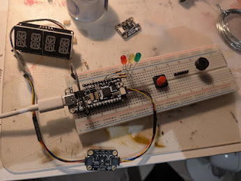

# Sensor projekt

## Förklaring

I detta projekt skall jag programmera en RP2040 som skall mäta av en VOC- och luftfuktighetssensor och beroende på mätvärden så indikera på olika sätt, se produktspecifikationen för detaljer.i detta projekt skall jag programera en rp2040 som skall mätta av en VOC och luftfuktinghets sensor  och beroende på mätvärden så indekera på olika för användaren vad som händer set se produkt [spesifisonen för detaljer](https://caspian.rosengren.nu/Projekt/skalSensor/digitalProjekt-1.pdf)

de tre stadierna

Citat från min del
``

Maskinen har 3 stadier som idekeras via de tre lamperna grön, gul och röd och 14x4 segments skärmen

Läggan

* Grön
  * De uppmätta värdena är acceptabla och ingenting behöver göras av användares.
  * Detta indikeras på skärmen med texten “FIN.”.
* Gul
  * De uppmätta värdena är på väg att överstiga de acceptabla nivåerna och användaren bör åtgärda problemet genom att till exempel vädra ut lokalen .
  * Detta indikeras på skärmen med texten “PRUB” vilket är en förkortning av Problemen.
* Röd
  * De uppmätta värdena är oacceptabelt höga och behöver åtgärdas omedelbart.
  * Detta indikeras på skärmen med texten “RUN!”.
  * Användaren kommer även att uppmärksammas att det är ett problem för dem med  ett alarm. Detta alar kan tystas genom att trycka på den röda knappen

Om du vill ha ut rådatan från sensor och vilket stadie den är i så kan du kopla in enheten i en dator och läsa av serial data med en bitrate av 9600.

Här har vi dokumenten som vi lämnade in [texten](https://caspian.rosengren.nu/blog/21-25/digital_projekt-2.pdf) och [själv reflektioner](https://caspian.rosengren.nu/blog/21-25/självAnalysAvprojektet.pdf)

# Kåd

[se bifogad fill](https://caspian.rosengren.nu/Projekt/skalSensor/sketch_may7b/sketch_may7b.ino)
