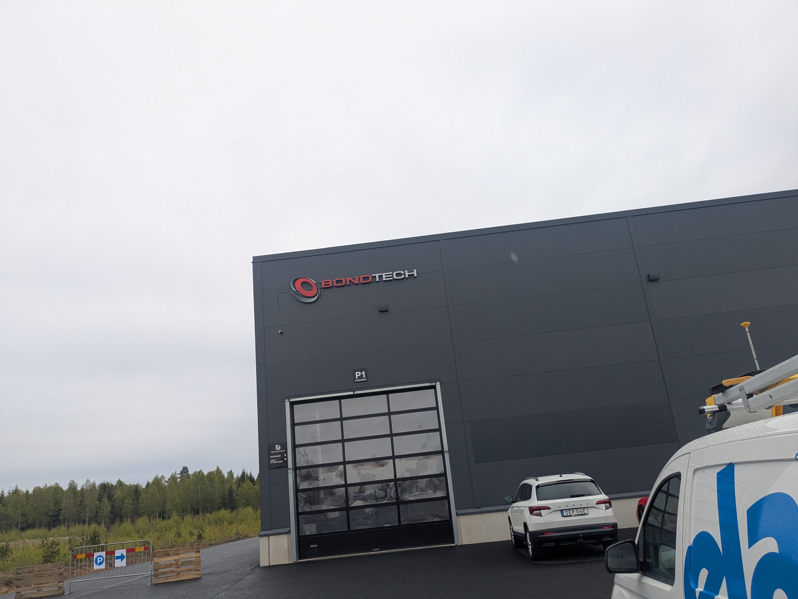
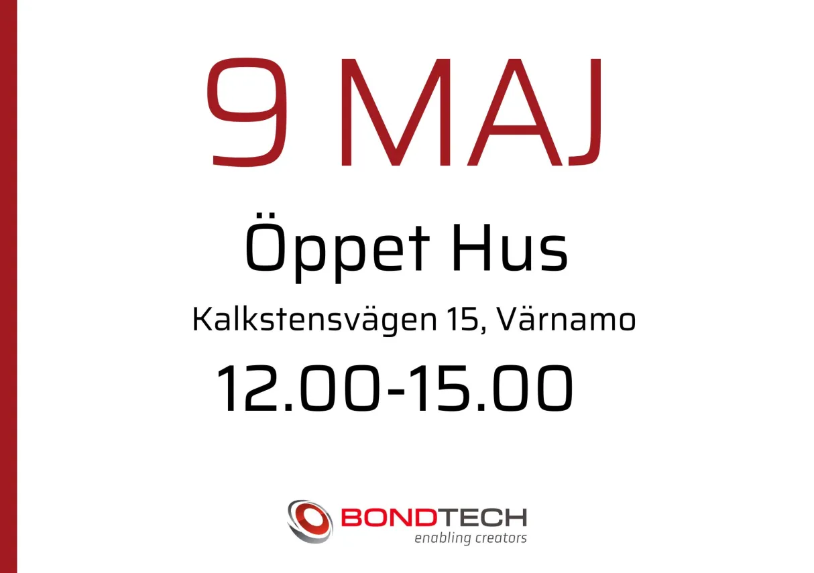

## Tillbacka till pluget

#### Vecka:19- 2025

## Vad har jag gjor

Gjorde en icke planerad resa till Bondtech i Värnamo (Småland). Fick veta på morgonen att de hade öppet hus. Farmor körde mig

Vi fick se deras fabrik, vilken var mindre än vad jag trodde (1 st 5-axlig Brother CNC, 1 st 3-axlig HAAS CNC, 4 st 9-axliga svarvar med automatisk materialmatning).

De visade även stället där de 3D-skrev kropparna av nylon med 4 Formlabs SLA 3D-skrivare.

Fike även se diras [test utrosting](https://caspian.rosengren.nu/blog/19-25/testUtrustning.html) och några [prototyper](https://caspian.rosengren.nu/blog/19-25/prototyper.html) och [Index](https://caspian.rosengren.nu/blog/19-25/index.html)

Men den viktigaste saken i fick se var den nya Index tool changern

## Skolla

Kommit tillbaka till skolan efter att ha haft lov så behöver komma ikapp med matten.
Introducerade kondensatorer i mätteknikkursen.
Klarade FMAA50 analys 1-tentan, vi får se hur det går med analys 2.
Har påbörjat programmering av RP2040 till en sensor, se detaljer på dess [sida](https://caspian.rosengren.nu/Projekt/skalSensor.html)

## Mat

Lök, lax sopa krydad med salt peppar och kurri. Serveras med ris

## Project

Seta up den här hemsidan

### Intresanta observationer och ideer

I [videon ](https://www.youtube.com/watch?v=VHwYfjPWG2M&t=50s) kunde vi se hur de överlappar olika element så att hela skärmen inte förändras, utan att man först låter karaktären i förgrunden förändras och att sedan efter en halv sekund byts bakgrunden. Hade varit intressant att pröva att göra någonting sådant i en film.

---

### Andra inläg

[Nästa inläg](https://caspian.rosengren.nu/blog/20-25.html)  [Top lisat](https://caspian.rosengren.nu/blog.html)  [Föra inläget](https://caspian.rosengren.nu/blog/19-25.html)

