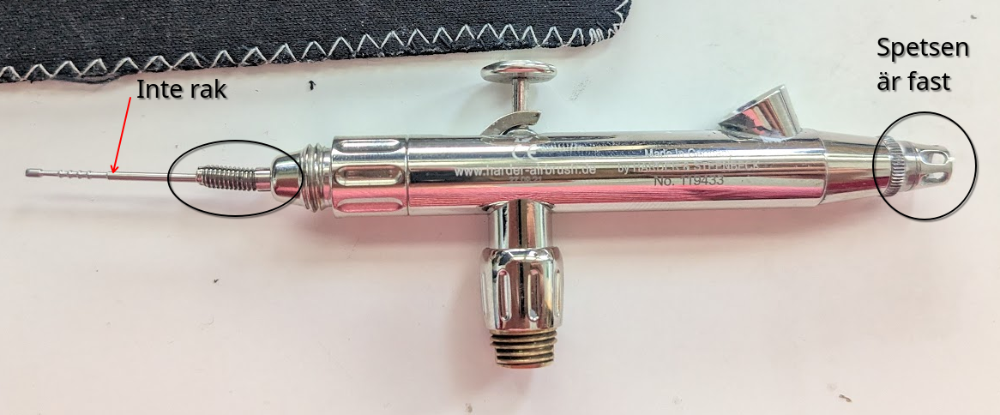
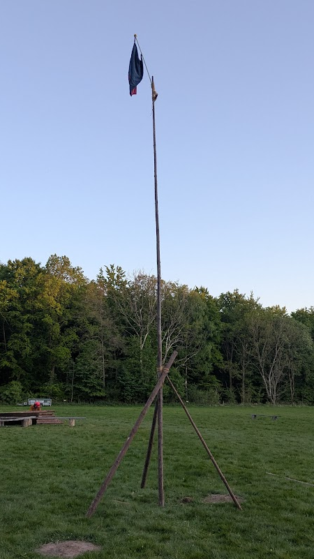
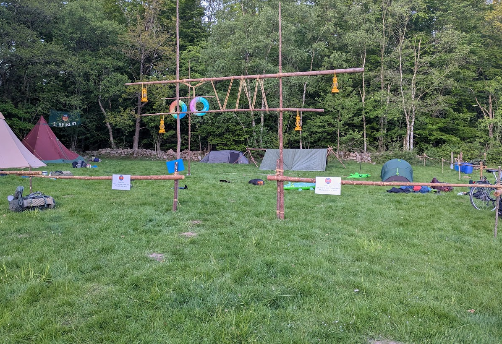
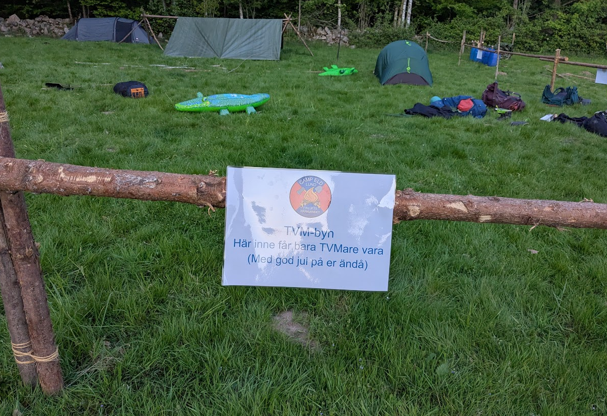
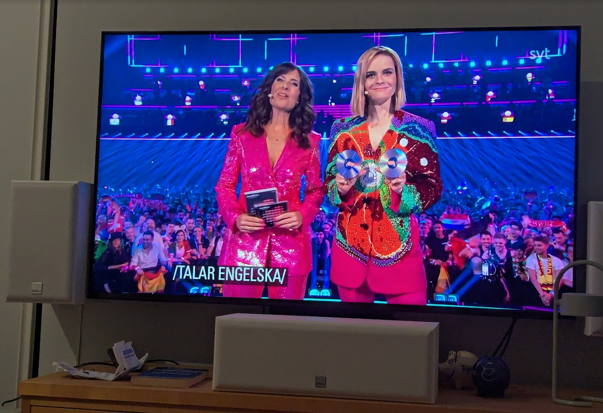
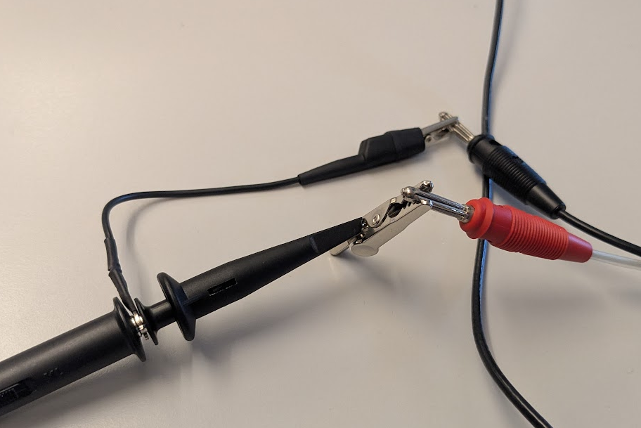

## Tittel:

#### Vecka:20 - 2025

## Vad har jag gjor

Läste färdigt Frieren bock 11 och 12, åsikter [här](https://caspian.rosengren.nu/Books/frieren.html)

Lyckades böja den bakre dellen av airbruchen
Får se om jag kan hitta resärv dellar

### Kammp eld

Friluftsfremjandet organiserade sitt årliga kamp el. I år hade jag inte tenkt delta. I slutendan hjälpet jag till att bygga flagstongen och vindskyd

Altid lika rolligt att se TVM hörnan här vi bumpar alla högljuda TVMare så att dem inte invederar rästen av lägerplatsen

### Eurovision

Tittade på eurovison, vissa låtar var skräp andra var dåliga

Med det rolingaste var att personen som levereerad textningen inte kände för att transkribera när dem pratade på engelska så det såg ganska roligt ut

## Skolla

Mer matte

Mät teknik lab
Väldigt optimalt sett att använda seta fast probs till ett osyloskåp

## Mat

Kokta linser sarveras med ris

## Project

Lagt till en sida om [Firn cospaly](https://caspian.rosengren.nu/cosplay/firnCosplay.html)

---

### Intresanta observationer och ideer

### Andra inläg

[Nästa inläg](https://caspian.rosengren.nu/blog/21-25.html)  [Top lisat](https://caspian.rosengren.nu/blog.html)  [Föra inläget](https://caspian.rosengren.nu/blog/20-25.html)
