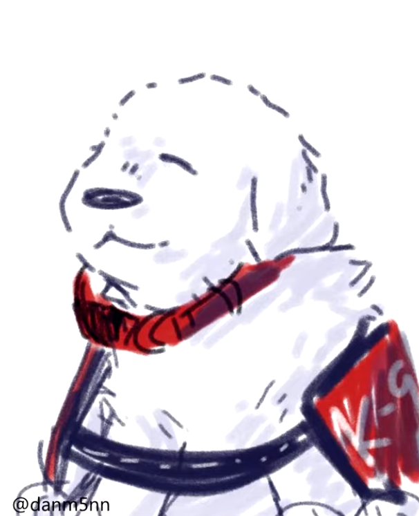
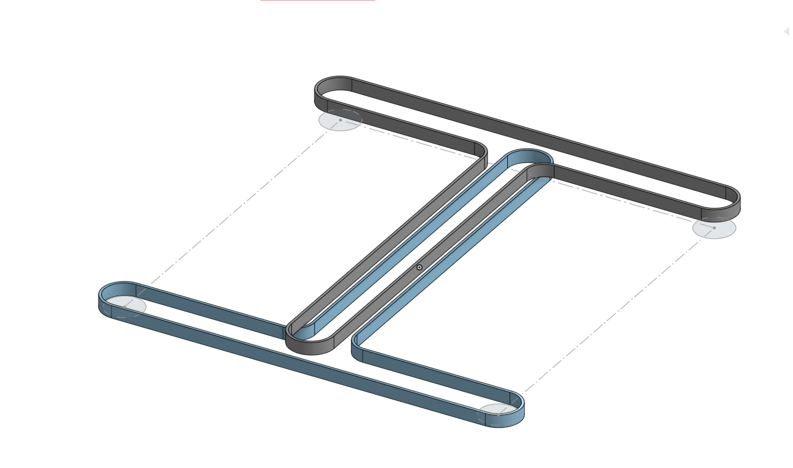
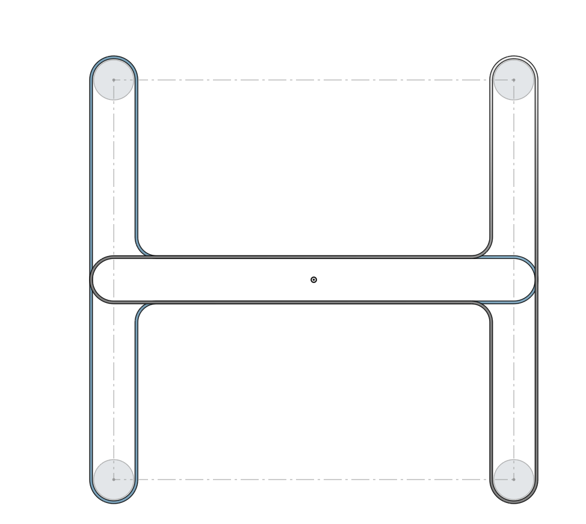

## Tittel:

#### Vecka:21 2025

## Vad har jag gjor

### Qipao

Har läst alldäles för mycket om hur Qipao är konstruerade
https://www.mingmakes.com/post/fitting-the-qipao-cheongsam-dress

https://www.mingmakes.com/post/qipao-cheongsam-dress-with-lace

https://www.thepankou.com/qipao-cheongsam-parts-comprehensive-guide/
https://sewingplums.com/2011/03/12/oriental-style-cheongsam/

### Bok

Köpte Maus och inväntar att få läsa den

### Söt hund

https://www.youtube.com/watch?v=6BwKDbHnO6A

## Skolla

Sensor projektet är nu färding
Kladade ihop en presentation på en eftermidag

[projektet](https://caspian.rosengren.nu/Projekt/skalSensor.html)

## Mat

lök, linser, och ris

## Project

---

### Intresanta observationer och ideer

En välldig dålig ide på hur man kan designa en annan kimetatik

### Andra inläg

| [Nästa inläg](https://caspian.rosengren.nu/blog/22-25.html) | [Top lisat](https://caspian.rosengren.nu/blog.html) | [Föra inläget](https://caspian.rosengren.nu/blog/20-25.html) |
| --------------------------------------------------------------- | ----------------------------------------------------- | ---------------------------------------------------------------- |
|                                                               |                                                     | Kamp eld                                                       |
