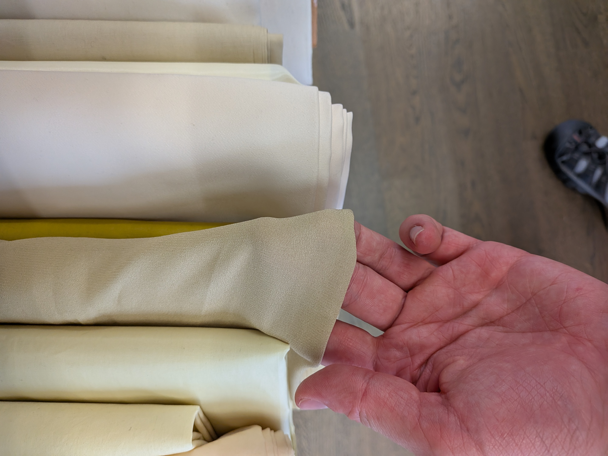
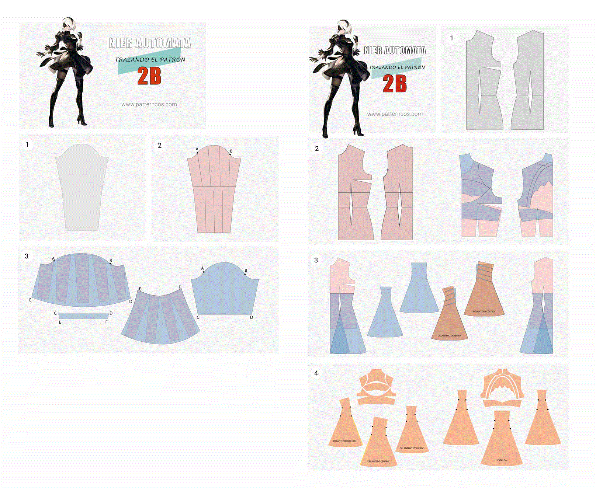
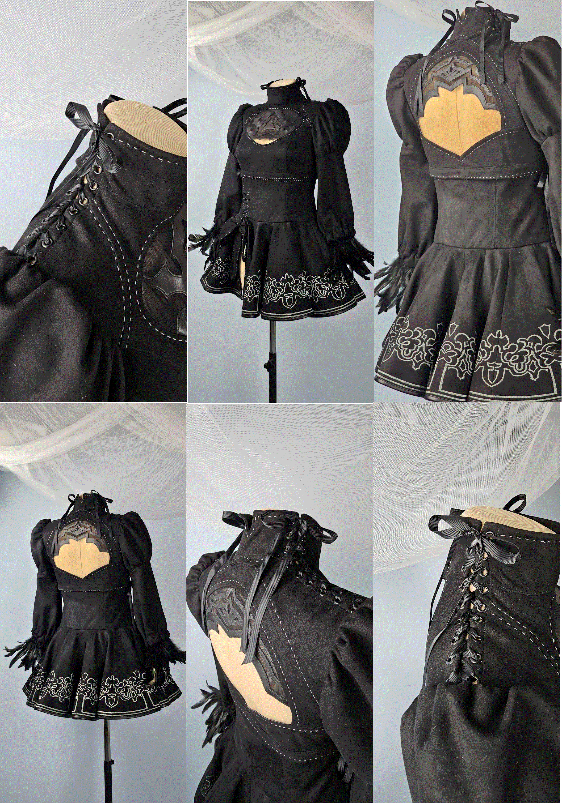
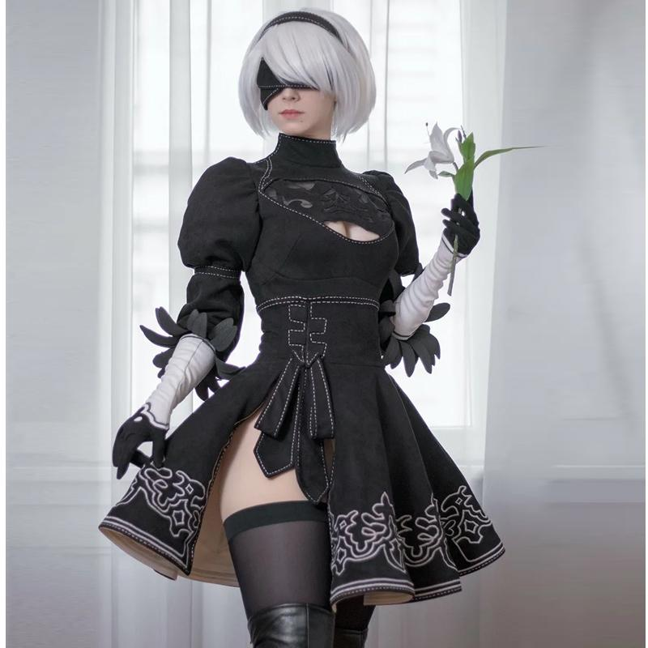
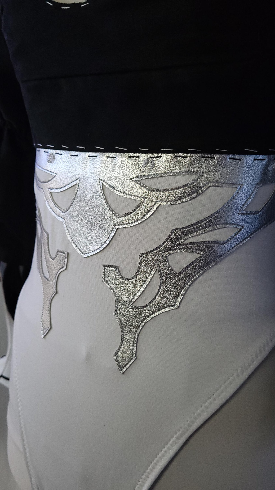
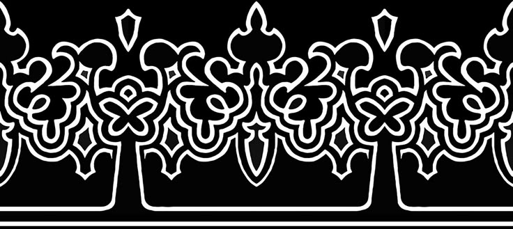
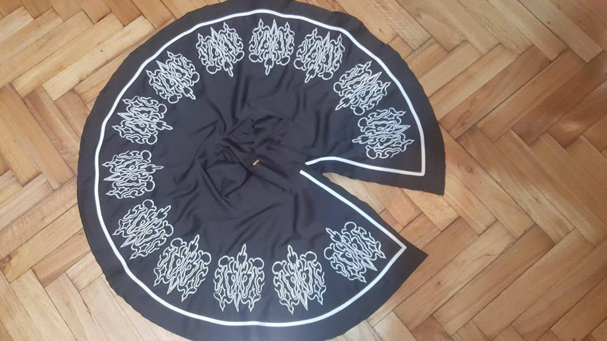
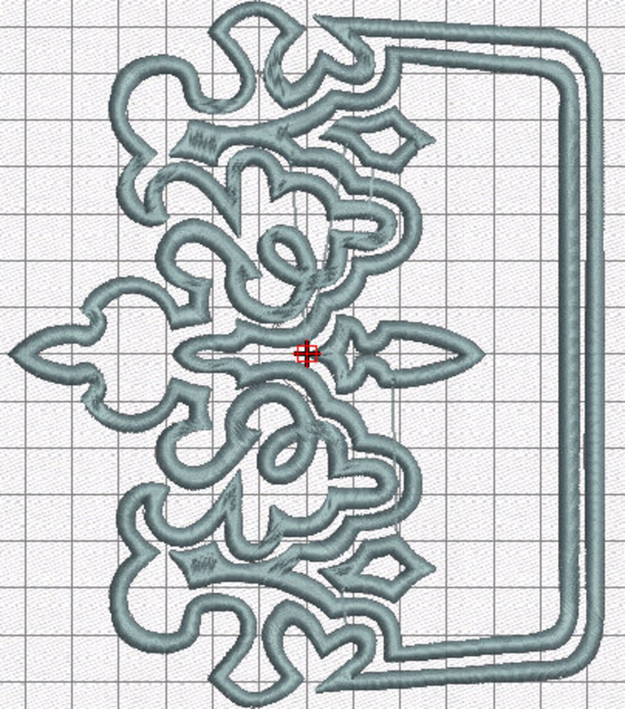

# Strumpbyxer

[Strupbyxer](https://youtu.be/48cxklD9IYQ)

[Boots](https://youtu.be/G9TrTkfAEOM)

# Tyg

Övre är från [Gårda Textil](https://maps.app.goo.gl/4xGN2YGYAQpnunak6)

Nedre är från [Furulunds Modetyger AB](https://maps.app.goo.gl/ijiQ3ojiGQS7j7jm6)

Strech tyg för de dellarna av backsiden och stumpbykerna som ska se ut som hud från [Bernt i Lund - för dig som älskar att sy](https://maps.app.goo.gl/NKuGK6hm94uYdo726)

alternativ från [The Gallery shop](https://maps.app.goo.gl/XmyV6Tq3BR4ZSsEGA)

# Mönster

# Refferens

^[Länk]([https://www.etsy.com/se-en/listing/1856665144/nier-automata-2b-cosplay-patterns-and?ls=s&dd=1&content_source=f70b6079-a4d0-4226-96e6-bdba05fc9a59%3ALTb2aaa00bc72194fc21e8eeae1be827b7de75fd44&dd_referrer=https%3A%2F%2Fwww.etsy.com%2Fmarket%2Fnier_automata_2b_pattern](https://www.etsy.com/se-en/listing/1856665144/nier-automata-2b-cosplay-patterns-and?ls=s&dd=1&content_source=f70b6079-a4d0-4226-96e6-bdba05fc9a59%3ALTb2aaa00bc72194fc21e8eeae1be827b7de75fd44&dd_referrer=https%3A%2F%2Fwww.etsy.com%2Fmarket%2Fnier_automata_2b_pattern "https://www.etsy.com/se-en/listing/1856665144/nier-automata-2b-cosplay-patterns-and?ls=s&dd=1&content_source=f70b6079-a4d0-4226-96e6-bdba05fc9a59%3ALTb2aaa00bc72194fc21e8eeae1be827b7de75fd44&dd_referrer=https%3A%2F%2Fwww.etsy.com%2Fmarket%2Fnier_automata_2b_pattern"))

