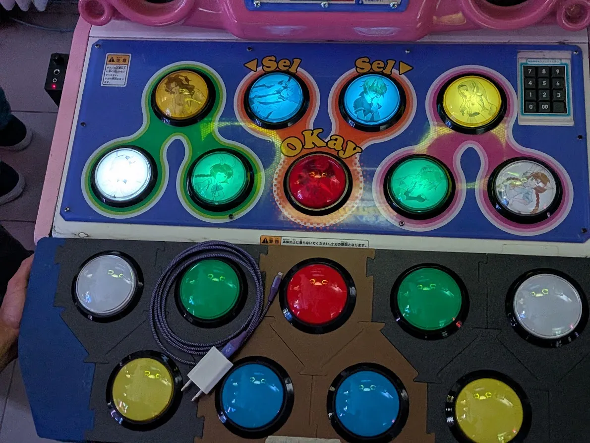
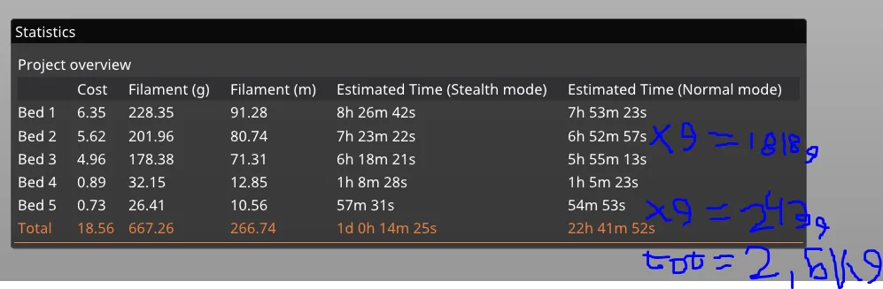
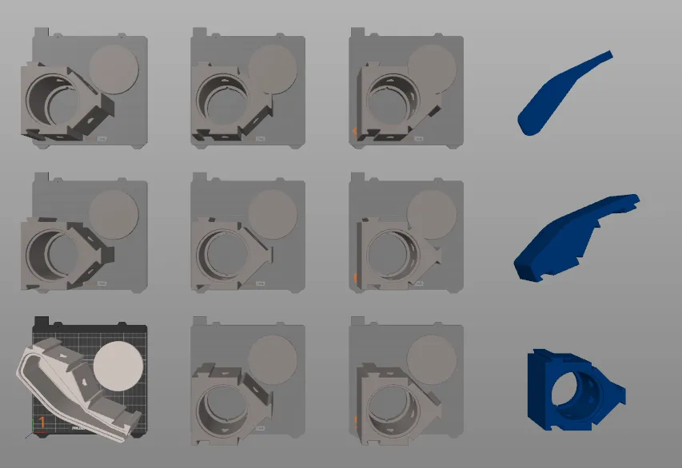
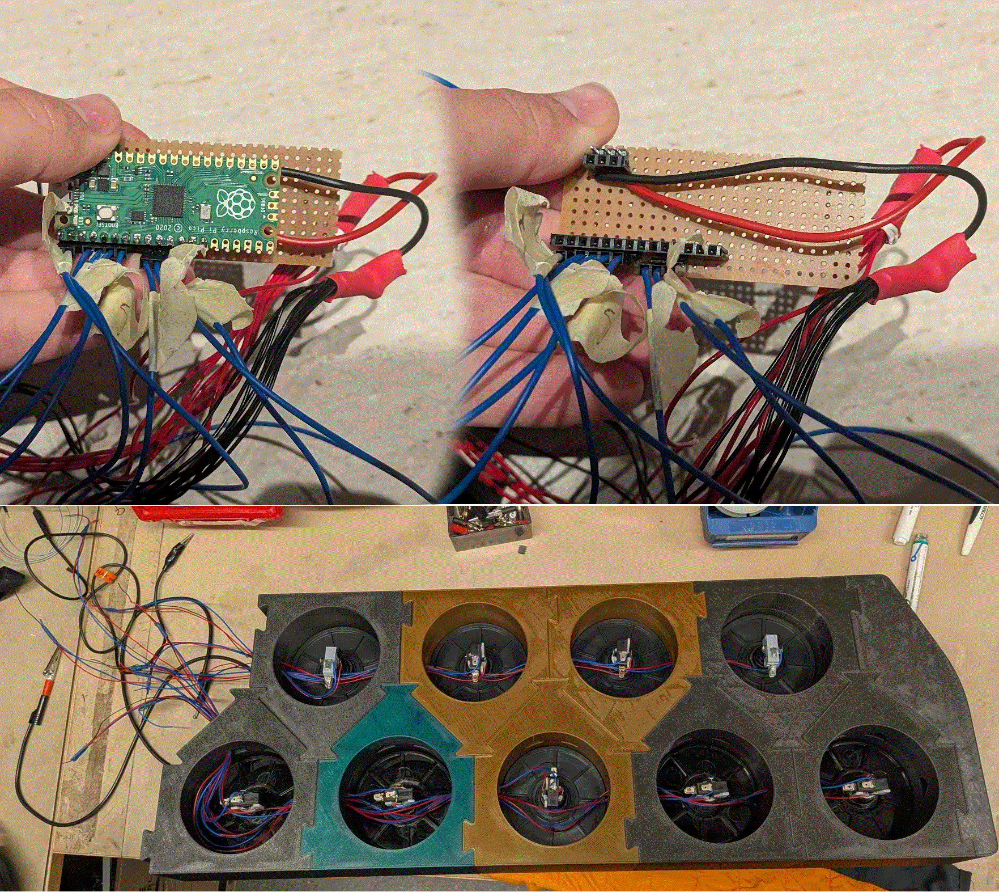

# PoP'n controller

## 3D dellar

Du kan hitta alla dellar [här](https://www.printables.com/model/1767870-screwless-popn-music-controller). Jag förklarar även visa saker bätre där.

utskiften tar cirka 2,5 kg av plast

## Electronik

## Kompuneter

| Kompunent                                                                                    | Kostnad     | Antal | tut     |
| -------------------------------------------------------------------------------------------- | ----------- | ----- | ------- |
| [Knappar](https://www.us.istmall.co.kr/Mobile/Product/Detail/view/pid/73/cid/161)            | 95kr        | 9     | 855kr   |
| [MCU](https://www.electrokit.com/en/raspberry-pi-pico)                                       | 54kr        | 1     | 54kr    |
| [Plast](https://www.3dprima.com/se/filament-resin/filament/abs/others/sunlu-abs_32405_16673) | 170kr       | 2,5kg | 425kr   |
| Övrigt                                                                                      | cirka 100kr | 1     | 100kr   |
| total                                                                                        |             |       | 1 434kr |
