# För min omtentamen

* Upgift 1
  * [A)](#1a)
  * [B)](#1b)
  * [C)](#1c)
  * [D)](#1d)
* Upgift 2
  * [A)](#2a)
  * [B)](#2b)
  * [C)](#2c)
  * [D)](#2d)
* Upgift 3

  * [A)](#3a)

  * [B)](#3b)

  * [C)](#3c)

  * [D)](#3d)
* Upgift 4

  * [A)](#4a)

  * [B)](#4b)

  * [C)](#4c)

  * [D)](#4d)

* Upgift 5

  * [A)](#5a)

  * [B)](#5b)

  * [C)](#5c)

  * [D)](#5d)

* Upgift 6

  * [A)](#6a)

  * [B)](#6b)

  * [C)](#6c)

  * [D)](#6d)

## Upgift 1

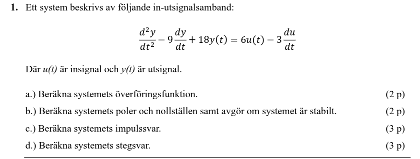

### 1a)

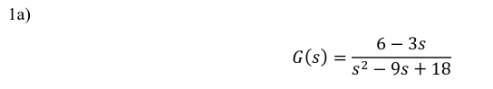

stuva om de så att du får u(t)/y(t) och ärset derivaran med s

### 1b)

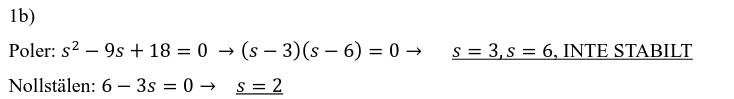

Hitta nolstelerna för nämnaren

båda ska vara negativa för att den ska vara stabil

### 1c)

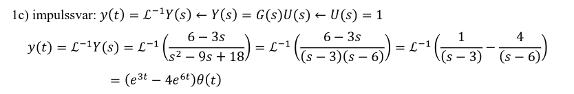

Läg på en impuls (se formelsamling) och seda gör invärsen för att få den nya funktionen

### 1d)

Läg på en steg (se formelsamling) och seda gör invärsen för att få den nya funktionen

## Upgift 2

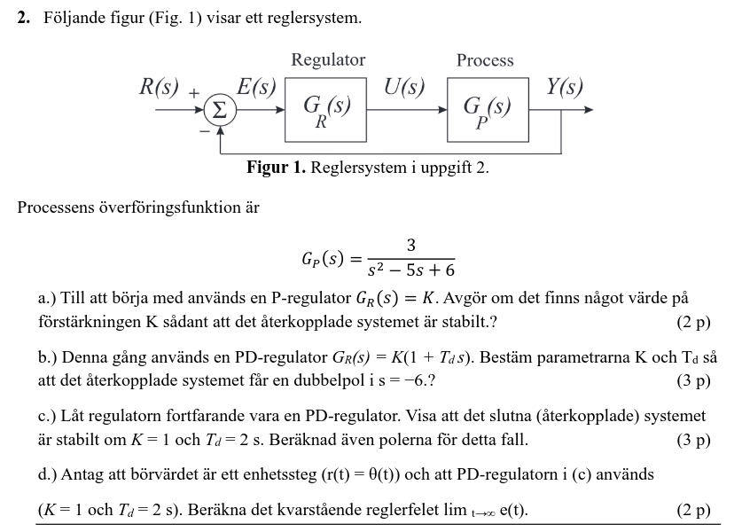

### 2a)

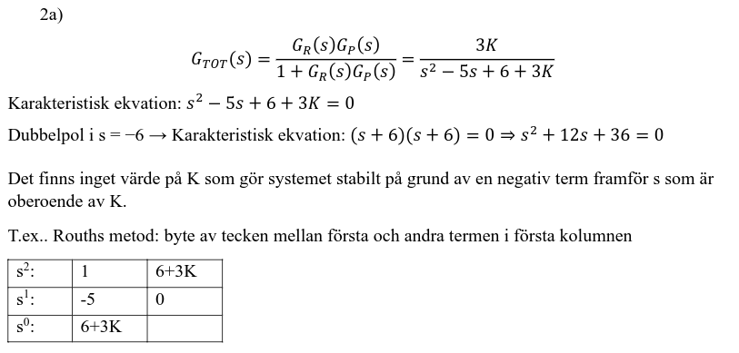

### 2b)

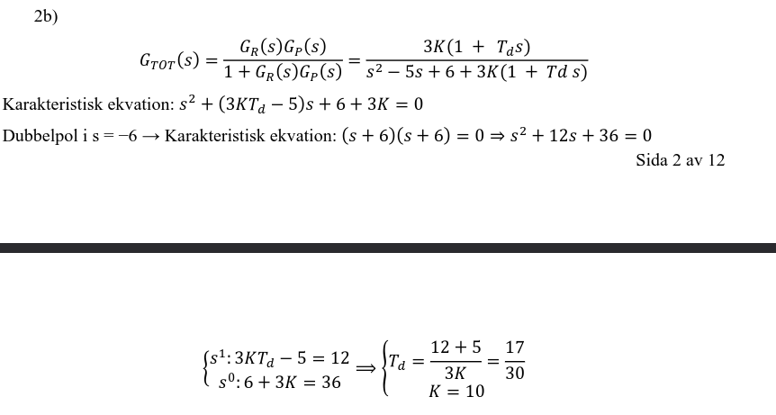

### 2c)

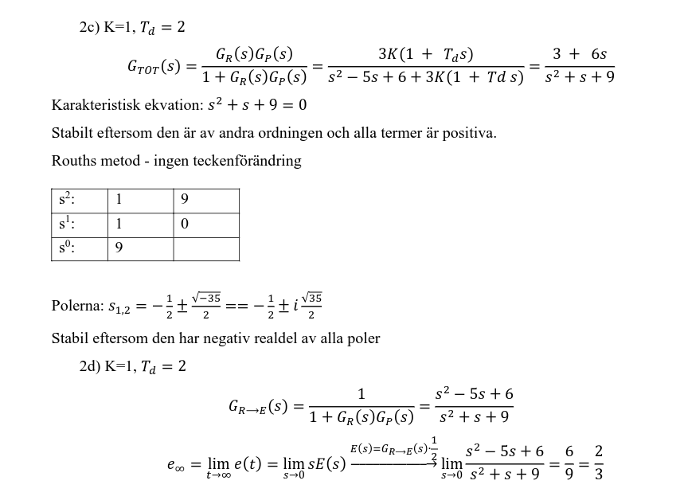

## Upgift 3

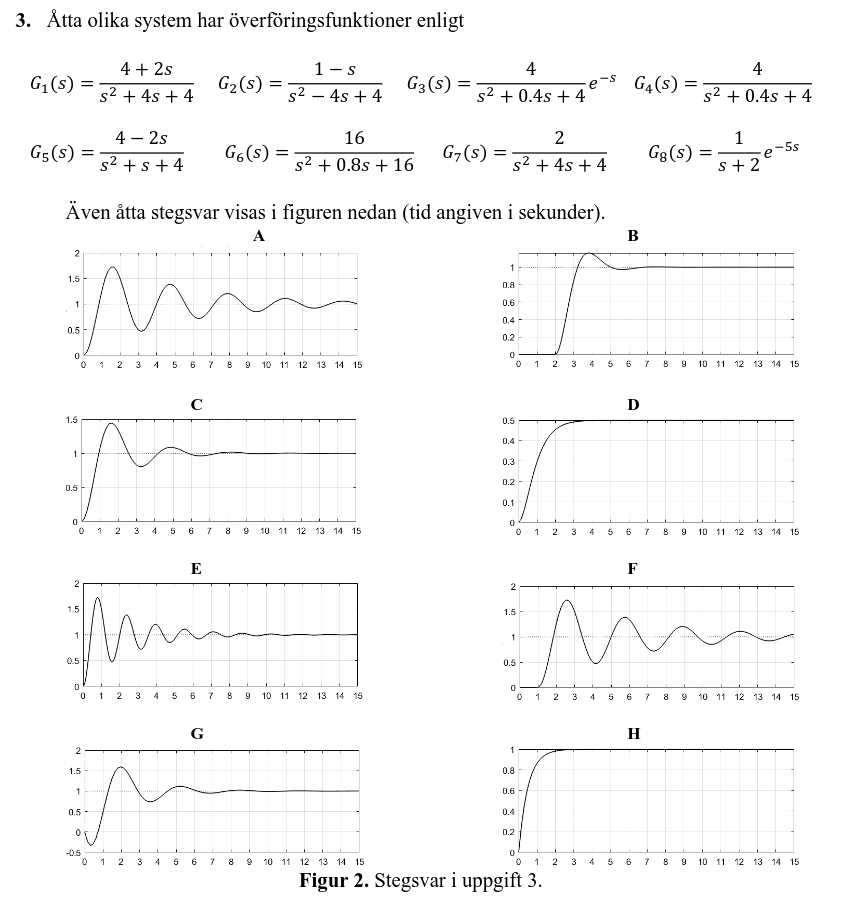

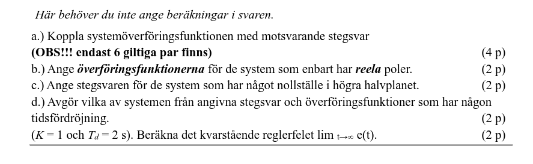

### 3a)

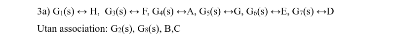

### 3b)

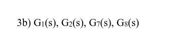

### 3c)

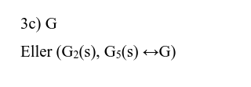

### 3d)

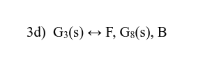

## Upgift 4

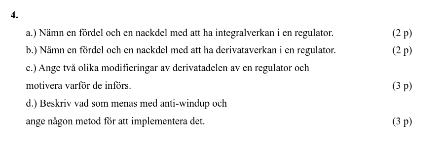

### 4a)

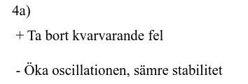

### 4b)

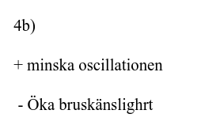

### 4c)

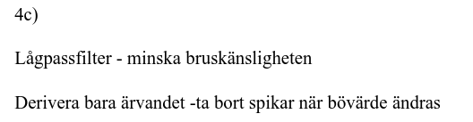

### 4d)

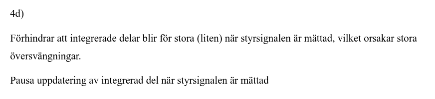

## Upgift 5

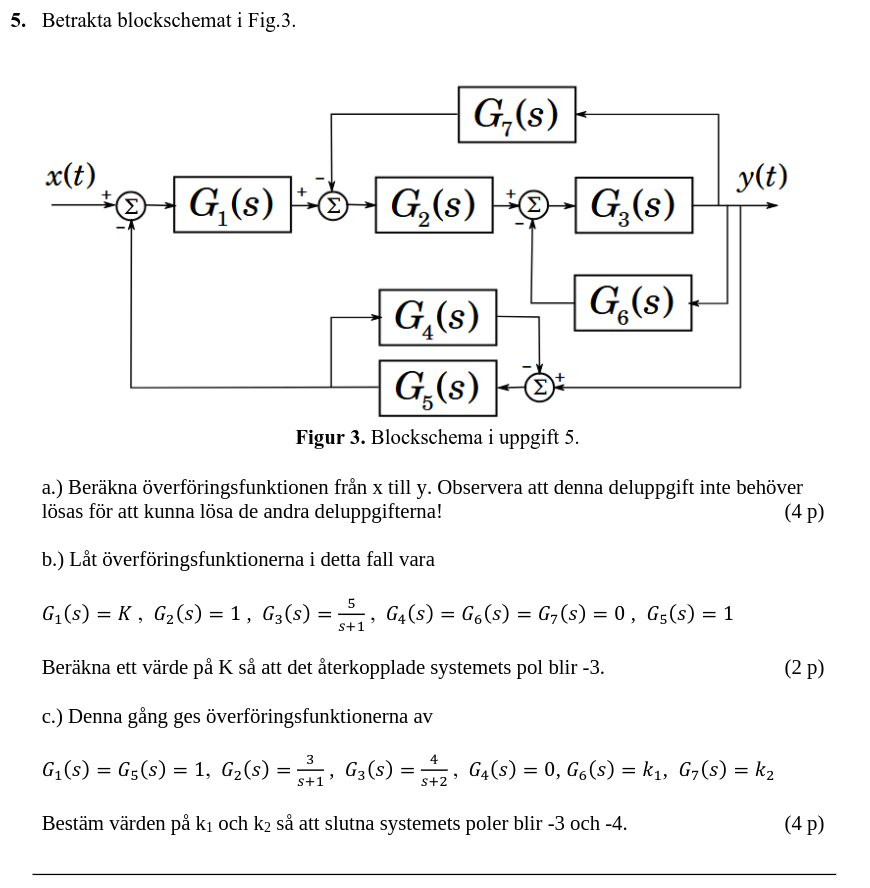

### 5a)

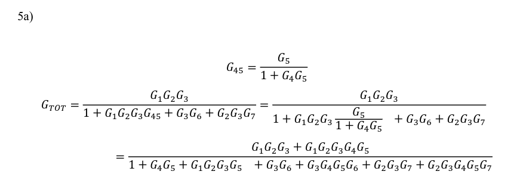

### 5b)

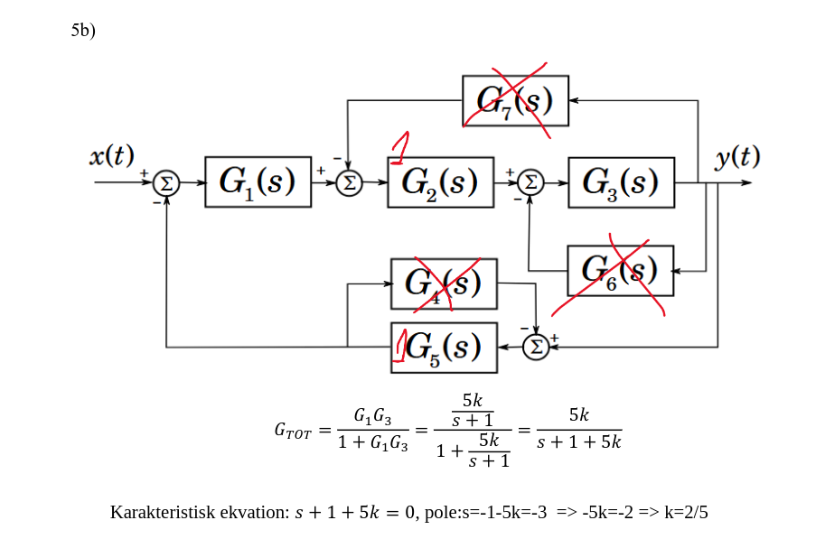

### 5c)

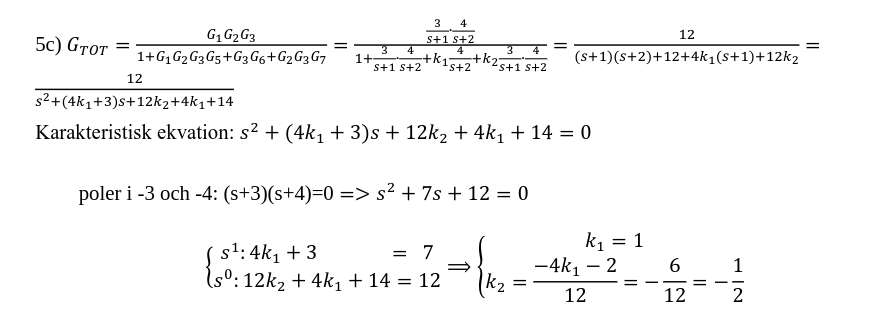

## Upgift 6

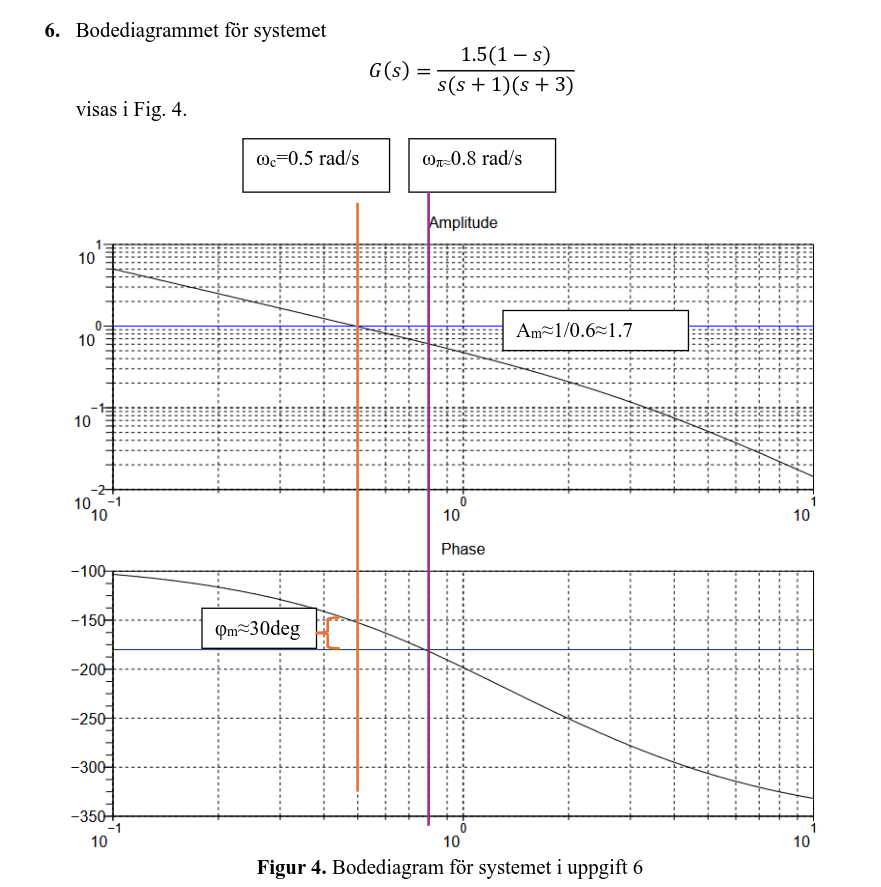

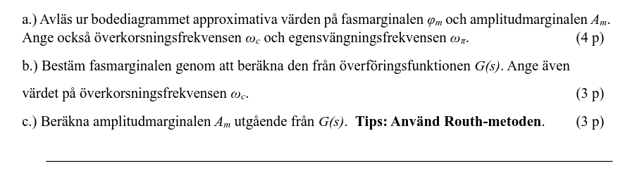

### 6a)

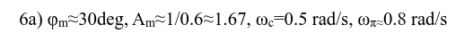

### 6b)

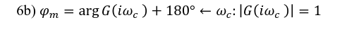

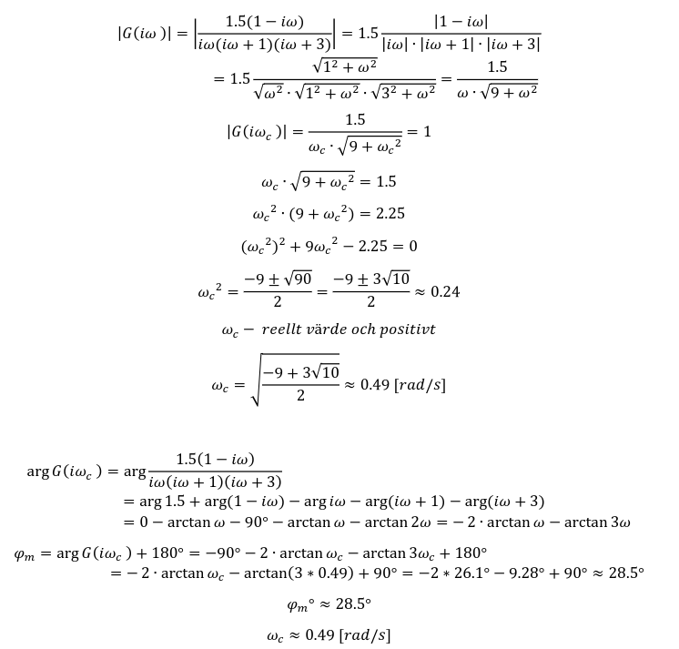

### 6c)

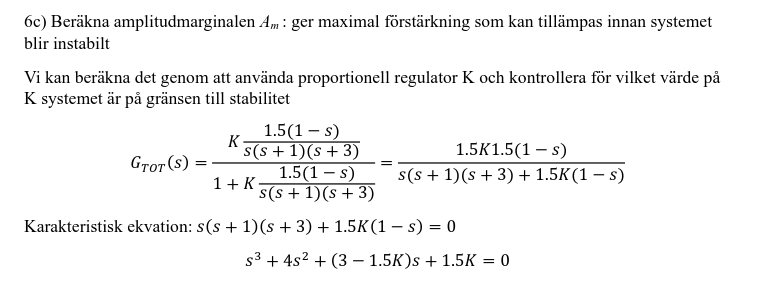

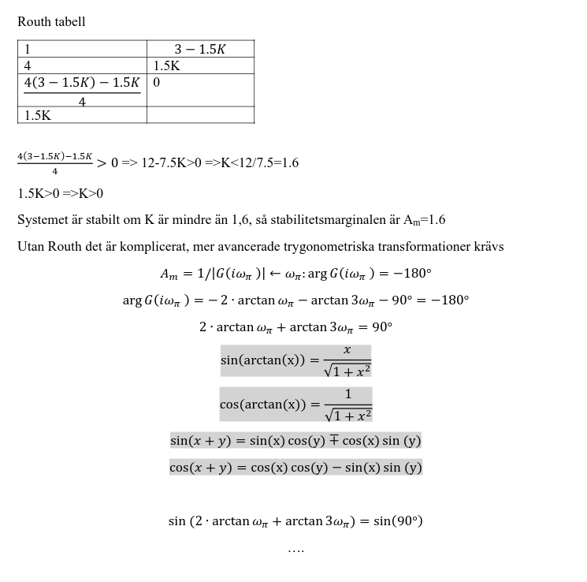
